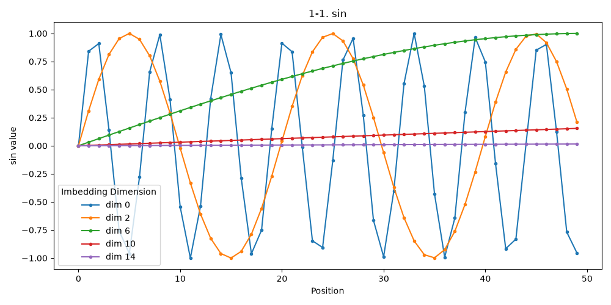
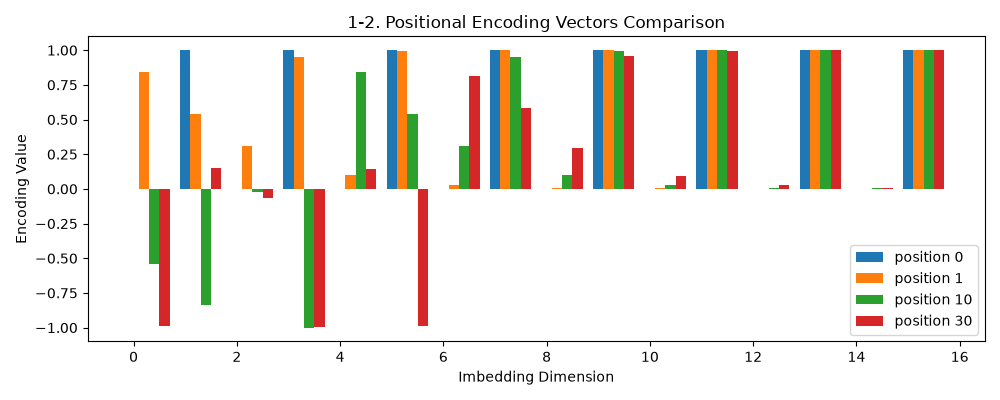
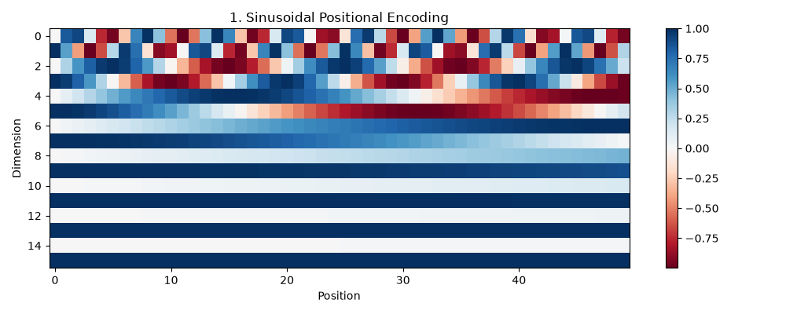

# 트랜스포머 인코딩

> **트랜스포머의 위치 인코딩 방식 3가지(기본 Sinusoidal, BERT의 학습형 절대 위치, RoPE 상대 위치)를 설명하고 비교하시오.**

---

## 목차

1. [트랜스포머의 기본 위치 인코딩 (Sinusoidal)](#1-트랜스포머의-기본-위치-인코딩-정현파sinusoidal-positional-encoding)
2. [BERT의 학습 가능한 절대 위치 인코딩](#2-bert의-학습-가능한-절대-위치-인코딩-learned-absolute-positional-embedding)
3. [RoPE 상대 위치 인코딩](#3-rope-rotary-positional-embedding---상대-위치-인코딩)

---

### 인코더?

트랜스포머 안에서의 인코더란
입력된 텍스트 데이터나 이미지 데이터를 문맥이 포함된 숫자형 벡터로 변환하는 트랜스포머의 입력처리 블록이다.

**비유하면**
- 인코더 한 층을 "요청을 받아서 가공한 뒤 다음 단계로 넘겨주는 미들웨어"라고 생각하면 이해하기 쉽다.
- 멀티헤드 셀프 어텐션은 "이 단어가 문장 속 다른 단어들과 어떤 관계인지" 문맥 정보를 채워 넣는 단계이고, 피드포워드 신경망은 그 결과를 한 번 더 다듬어서 다음 층으로 넘기는 단계다.
- 이런 층을 여러 개 쌓으면, 입력이 한 층씩 지날 때마다 점점 더 풍부한 문맥 정보를 담은 벡터가 된다.

**구성 요소**

인코더는 크게 두 가지 서브레이어로 구성된다.
- 멀티헤드 셀프 어텐션 (Multi-Head Self-Attention)
    - 여러 개의 헤드를 통해 단어 간의 관계성을 파악
    - 문장 안에서 특정 단어가 다른 단어와 얼마나 강한 연관성을 가지는지 계산
- 피드포워드 신경망 (Feed-Forward Network)
    - 어텐션으로 추출된 벡터들을 한 번 더 비선형적으로 가공하여 다음 층으로 전달하기 쉽게 만들어주는 신경망

**특징 (서브레이어를 보조하는 장치들)**
- 잔차 연결 (Residual Connection)
    - 층이 깊어져도 이전 정보를 잃지 않도록, 서브레이어에 들어간 입력을 출력에 그대로 더해서 전달하는 방법
- 층 정규화 (Layer Normalization)
    - 안정적인 학습을 위해 데이터를 정규화하여 분포를 일정하게 맞춰준다.
- Positional Encoding
    - 트랜스포머는 데이터를 순차적으로 받지 않기 때문에, 단어의 위치 정보를 벡터에 별도로 더해줘야 한다.

---

### 1. 트랜스포머의 기본 위치 인코딩 (정현파(Sinusoidal) Positional Encoding)

트랜스포머는 RNN과 달리 단어를 순서대로 하나씩 처리하지 않고 한 문장을 통째로(병렬로) 처리한다.
그래서 "이 단어가 몇 번째 단어인지"에 대한 정보가 입력 임베딩 자체에는 전혀 들어있지 않다.
이 문제를 해결하기 위해, 각 위치(position)마다 고유한 벡터를 만들어서 단어 임베딩에 **더해주는** 것이 Positional Encoding이다.

기본 트랜스포머는 이 벡터를 sin/cos 함수로 직접 계산한다.

```
PE(pos, 2i)   = sin(pos / 10000^(2i/d_model))
PE(pos, 2i+1) = cos(pos / 10000^(2i/d_model))
```
- `pos` : 토큰의 위치 (0, 1, 2, ...)
- `i` : 임베딩 벡터의 차원 인덱스 (0 ~ d_model/2)
- `d_model` : 임베딩 벡터의 전체 차원 수

**직관적으로 이해하면**
- 차원(i)마다 sin/cos의 주기(파장)가 다르다. 낮은 차원(i가 작을때)은 빠르게 진동하고, 높은 차원(i가 클때)은 느리게 진동한다.
- 시계의 시침/분침/초침처럼, 서로 다른 속도로 도는 바늘 여러 개를 조합하면 모든 시각(위치)을 고유한 패턴으로 표현할 수 있는 것과 비슷하다.

**그림으로 보면**



- x축은 위치(position), y축은 그 차원의 sin 값이다.
- `dim 0`은 빠르게 출렁이고(짧은 주기), `dim 14`는 거의 평평하다(긴 주기) → 차원마다 "속도가 다른 시계 바늘"인 셈이다.



- 같은 값을 위치 기준으로 잘라보면, position 0 / 1 / 10 / 30이 모두 다른 막대 패턴(=벡터)을 가진다.
- 빠른 바늘(dim 0)은 위치가 1만 바뀌어도 값이 크게 변하고, 느린 바늘(dim 14)은 위치가 많이 바뀌어야 값이 변한다.
- 이 "여러 속도의 바늘 조합"이 위치마다 고유한 벡터(지문)를 만들어내고, 이 벡터가 단어 임베딩에 더해진다.

**dim이 커질수록 위치들이 "비슷하게" 보인다**

- dim이 작을수록(빠른 바늘) 위치마다 값이 크게 달라져서, 가까운 위치(0, 1, 10, 30)도 서로 뚜렷하게 구분된다 → **위치를 세밀하게 본다**
- dim이 커질수록(느린 바늘) 값이 sin≈0, cos≈1 쪽으로 수렴해서, 0~30 정도의 위치 차이는 거의 똑같은 값으로 보인다 → **위치를 구분하지 못하고 뭉뚱그려 본다**
- 즉 작은 dim = 가까운 위치를 세밀하게 구분하는 눈, 큰 dim = 아주 먼 위치 차이가 나야 구분이 되는 눈. 이렇게 "보는 단위"가 다른 dim들을 다 합치면 어떤 위치든 고유하게 표현할 수 있게 된다.

**특징**
- 학습되는 파라미터가 아니라 **고정된 값**(수식으로 계산) → 추가로 학습할 게 없다.
- sin/cos의 주기성 덕분에, 학습 때 본 적 없는 더 긴 문장(더 큰 position)에도 그대로 계산해서 적용할 수 있다.
- sin(a+b) = sin(a)cos(b) + cos(a)sin(b) 같은 삼각함수 덧셈 정리 덕분에, 두 위치의 인코딩을 선형 조합하면 위치 차이(상대 위치) 정보도 어느 정도 표현된다고 알려져 있다. (다만 명시적으로 "상대 위치"를 모델링하는 방식은 아니다)

---

### 2. BERT의 학습 가능한 절대 위치 인코딩 (Learned Absolute Positional Embedding)

BERT(Bidirectional Encoder Representations from Transformers)
- 구글에서 공개한 자연어 처리 인공지능 모델
- sin/cos 같은 고정 함수를 쓰는 대신, 단어 임베딩처럼 **위치 임베딩도 학습 가능한 파라미터**로 둔다.

즉, "0번 위치는 이 벡터, 1번 위치는 이 벡터, ... max_position(BERT는 보통 512)번 위치는 이 벡터" 처럼
위치별 벡터를 담은 **테이블(임베딩 매트릭스)**을 두고, 학습 과정에서 이 값들을 직접 업데이트한다.
구조적으로는 단어 임베딩 테이블과 완전히 동일하고, 입력이 단어 ID가 아니라 위치 인덱스(0, 1, 2, ...)라는 점만 다르다.

**비유하면**
- 정현파(sinusoidal) 방식은 "위치 → 값"을 **계산하는 함수(수식)**
- BERT 방식은 "위치 → 값"을 미리 채워둔 **테이블에서 조회(lookup)** 하는 것 (position_id를 키로 쓰는 테이블이라고 생각하면 된다)

**장단점**
- 장점: 데이터에 맞게 위치 정보 자체를 최적화할 수 있어서 성능이 더 좋게 나올 수 있다.
- 단점: 테이블 크기(`max_position_embeddings`, BERT는 보통 512)가 고정되어 있어서, 그보다 긴 문장은 처리할 수 없다. 테이블에 해당 위치의 행 자체가 없기 때문 (index out of range).
  - 정현파(sinusoidal)은 함수라서 어떤 위치든 계산만 하면 되지만, 학습형 테이블은 학습 때 본 위치까지만 의미 있는 값을 가진다.

---

### 3. RoPE (Rotary Positional Embedding) - 상대 위치 인코딩

위 두 방식은 모두 "위치 정보를 담은 벡터를 단어 임베딩에 더하는" 방식으로, **절대 위치(absolute position)** 정보를 주입한다.
RoPE는 접근 방식이 다르다. 위치 정보를 벡터에 **더하지 않고**, Query/Key 벡터 자체를 위치에 따라 **회전(rotate)** 시킨다.

**핵심 아이디어**
- 임베딩 벡터를 2개씩 짝지어서(차원 0&1, 2&3, 4&5 ...) 각각 2차원 평면의 좌표 (x, y)라고 생각한다.
- 위치 `pos`에 있는 토큰이면, 이 좌표를 `pos * 회전각도` 만큼 회전시킨다. 차원 짝마다 회전 속도(각도)가 다른데, 이 속도는 정현파(sinusoidal)과 동일한 주파수 컨셉을 사용한다.
- attention은 Query와 Key를 내적(dot product)해서 점수를 계산하는데, **회전된 두 벡터의 내적은 두 위치의 "회전 각도 차이"에만 의존**하게 된다.
  - 즉 query가 5번 위치, key가 10번 위치든 / query가 100번, key가 105번이든, 둘 다 "차이가 5"이기 때문에 attention 점수에 같은 영향을 준다. ([example.py](example.py) 실행 결과 참고)
- 정리하면, 위치를 벡터에 "더하는" 게 아니라 "회전시켜서 상대적 위치 차이를 attention 점수에 자연스럽게 반영"하는 방식이다.

**장단점**
- 장점: 상대적 위치 관계를 명시적으로 반영하기 때문에, 학습 때보다 더 긴 문맥에서도 일반화가 잘 되는 편이다. (LLaMA, GPT-NeoX 등 최신 LLM에서 많이 사용)
- 장점: 정현파(sinusoidal)처럼 추가 학습 파라미터가 없다.
- 단점: 구현이 직관적이지 않고(벡터를 짝지어 회전시켜야 함), Query/Key에만 적용되고 Value에는 적용되지 않는다.

---

### 정리

| | 1. 정현파(sinusoidal) (기본) | 2. BERT (학습형 절대 위치) | 3. RoPE (상대 위치) |
|---|---|---|---|
| 위치 정보 적용 방식 | 임베딩에 더하기 | 임베딩에 더하기 | Query/Key를 회전 |
| 학습 파라미터 | 없음 (고정 함수) | 있음 (테이블) | 없음 (고정 함수) |
| 더 긴 문장 처리 | 가능 (수식이라 계산만 하면 됨) | 불가능 (테이블 크기 고정) | 가능 |
| 표현하는 위치 정보 | 절대 위치 (상대 위치는 간접적) | 절대 위치 | 상대 위치 (명시적) |

<details>
<summary><strong>example.py 실행해보기</strong></summary>

[example.py](example.py)를 실행하면 세 가지 방식을 직접 코드로 확인할 수 있다.

1. **정현파(sinusoidal)**: 위치별 인코딩 벡터를 heatmap으로 시각화 (`output_1_sinusoidal.png`)
   - 위치(가로축)가 달라지면 색 패턴이 전부 달라지고, 차원(세로축)마다 변화 속도가 다른 것을 볼 수 있다.

   

2. **BERT 학습형 절대 위치**: 위치별 임베딩 테이블을 랜덤 초기화해서 모양만 확인하고, 테이블 크기를 넘는 위치를 조회하면 `IndexError`가 발생하는 것을 직접 확인한다.

3. **RoPE**: 임의의 query/key 벡터를 만들고, 여러 (query 위치, key 위치) 쌍에 대해 회전 후 내적 점수를 계산한다.
   - 상대거리가 같은 (0,5), (10,15), (100,105)의 점수가 전부 동일하게 나온다 → 절대 위치가 아니라 위치 "차이"만 점수에 반영된다는 것을 수치로 확인할 수 있다.

</details>

---

<details>
<summary><strong>회고</strong></summary>

**"위치 정보가 왜 따로 필요하지?"가 제일 먼저 막혔다.**
RNN처럼 순서대로 하나씩 넣어주면 되는 거 아닌가 했는데, 트랜스포머는 문장을 통째로 병렬 처리하기 때문에 입력 임베딩만 보면 "이 단어가 몇 번째인지"에 대한 정보가 전혀 없다는 걸 알고서야 왜 Positional Encoding이 필요한지 감이 왔다.

**Sinusoidal과 RoPE가 같은 주파수 개념(`10000^(2i/d_model)`)을 쓴다는 게 신기했다.**
하나는 "더하기"고 하나는 "회전"이라 완전히 다른 방식이라고 생각했는데, 차원마다 다른 속도로 움직이는 시계 바늘이라는 아이디어 자체는 둘 다 그대로 쓰고 있었다. 적용 방식만 다를 뿐 핵심 아이디어는 재사용된다는 걸 example.py로 직접 비교해보고 이해했다.

**BERT의 학습형 위치 임베딩은 결국 "테이블 조회"였다.**
처음에는 "학습 가능한 위치 인코딩"이라는 말이 추상적으로 느껴졌는데, 결국 단어 임베딩 테이블과 똑같이 position_id로 테이블을 조회하는 것뿐이었다. 그래서 `max_position_embeddings`를 넘는 위치를 조회하면 `IndexError`가 나는 것도, 평소 DB에서 범위를 벗어난 인덱스를 조회할 때 나는 에러와 똑같은 느낌이라 바로 와닿았다.

**RoPE의 "상대 위치"는 숫자로 직접 보니까 진짜 신뢰가 갔다.**
설명만 들었을 때는 "회전시키면 상대 위치만 남는다"는 말이 잘 믿기지 않았는데, example.py에서 (0,5), (10,15), (100,105)처럼 절대 위치는 다르지만 거리(5)가 같은 쌍들의 내적 점수가 전부 똑같이 나오는 걸 직접 확인하니 확실히 이해됐다. 코드로 한 번 검증해보는 게 말로만 듣는 것보다 훨씬 도움이 됐다.

</details>
