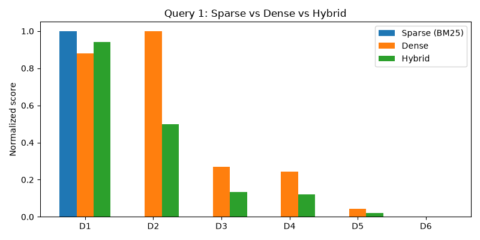
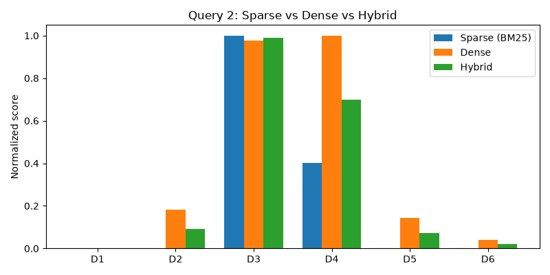
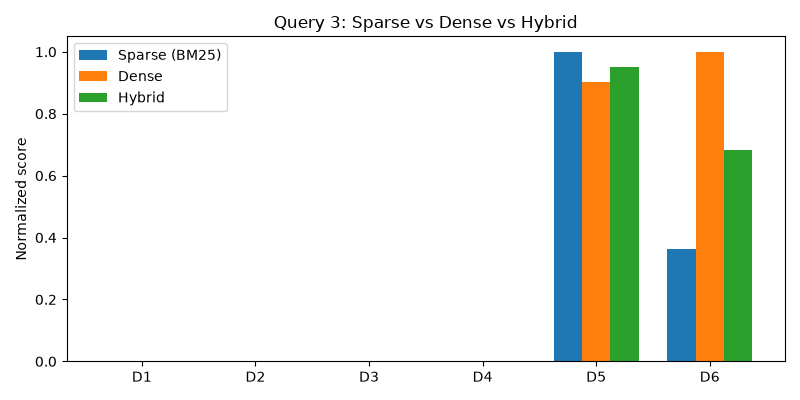

# Hybrid Search

> **Hybrid Search가 Sparse Vector 검색과 Dense Vector 검색을 결합해 검색 품질을 높이는 원리를 설명하시오. 또한 키워드 기반 검색만 사용했을 때와 의미 기반 검색만 사용했을 때 발생할 수 있는 검색 실패를 Hybrid Search가 어떻게 보완하는지 분석하시오.**

---

## 목차

1. [Sparse Vector 검색](#1-sparse-vector-검색)
2. [Dense Vector 검색](#2-dense-vector-검색)
3. [Hybrid Search 결합 원리](#3-hybrid-search-결합-원리)
4. [각 방식의 실패와 Hybrid의 보완 방법](#각-방식의-실패와-hybrid의-보완-방법)

---

### Hybrid Search?

Hybrid Search란 **Sparse Vector 검색(키워드 기반)**과 **Dense Vector 검색(의미 기반)**을 동시에 수행하고, 두 결과를 점수 단위로 합쳐서 하나의 순위로 만드는 검색 방식

- Sparse 검색은 "이 단어가 문서에 그대로 들어있는가"를 보는, 글자 그대로 매칭하는 검색이다. Ctrl+F로 찾는 것과 비슷하다.
- Dense 검색은 "이 문서가 의미적으로 비슷한가"를 보는, 맥락을 이해하는 검색이다.
- 두 방식은 서로 잘하는 영역이 정반대라서, 한쪽이 놓치는 문서를 다른 쪽이 잡아주는 경우가 많다. 그래서 둘을 같이 쓰면 서로의 약점을 메워준다.

---

### 1. Sparse Vector 검색

**sparse vector란**
- 희소하게 분포된 벡터로, 일부 값만 채워져있고 나머지는 0의 값을 가지고 있는 벡터
- 전체 어휘 사전 크기에 비해 극히 일부 차원만 유의미한 값을 가진다.
- 예시
  - `"KTB is a new challenge"` 라는 문장
  - → `["KTB", "is", "a", "new", "challenge"]` 로 나눌 수 있음
  - → `"new challenge"`를 sparse vector로 변환하면 → `[0, 0, 0, 1, 1]`
  - → 실제 어휘 사전은 훨씬 크므로(수만~수십만 차원), 그 중 값이 채워진 차원은 단어 개수만큼뿐이다.

**대표 기법**
- **BoW (Bag of Words)** — 단어가 몇 번 나왔는지만 카운트
- **TF-IDF** — 여러 문서에서 자주 등장하는 단어(조사, 일반적인 단어 등)의 가중치는 낮추고, 특정 문서에서만 자주 나오는 핵심 키워드는 강조
- **BM25** — TF-IDF를 개선한 알고리즘. 문서 길이에 따른 점수 보정(긴 문서가 단순히 단어를 많이 포함한다고 해서 무조건 높은 점수를 받지 않도록 normalize)이 들어가며, 현재 키워드 검색의 사실상 표준으로 쓰인다.

**장단점**
- 장점: 고유명사, 코드, 주문번호, 오탈자가 아닌 정확한 키워드는 매우 정확하게 잡아낸다. 계산이 가볍고 결과 해석이 직관적이다.
- 단점: **문자열 그대로 일치하는지만 본다.** 같은 의미라도 단어가 다르면(동의어, 다른 표현) 전혀 매칭이 안 된다.

---

### 2. Dense Vector 검색

**dense vector란**
- 대부분의 차원에 의미 있는 실수값이 빽빽하게 채워진 벡터. 보통 수백 차원(예: 384, 768, 1536차원)으로, BERT 계열 임베딩 모델이 문장 전체를 통째로 입력받아 만들어낸다.
- "단어가 있는가/없는가"가 아니라 "이 문장이 의미적으로 어떤 위치에 있는가"를 좌표로 표현한 것.

- Sparse vector는 "단어가 있는 자리만 체크하는 출석부"라면, Dense vector는 "문장의 의미를 GPS 좌표 하나로 압축한 것"이라고 생각하면 된다.
- 의미가 비슷한 문장은 이 좌표(벡터)도 서로 가깝게 위치한다. `"그래픽카드"`와 `"GPU"`는 글자는 완전히 다르지만, 의미가 비슷하므로 임베딩 공간에서는 가까운 벡터가 된다.

**검색 방식**
- 쿼리도 같은 임베딩 모델로 벡터화한 뒤, 문서 벡터들과의 **코사인 유사도(cosine similarity)**를 계산해서 가장 가까운(유사도가 높은) 문서를 순위로 뽑는다.
- 단어가 정확히 일치하지 않아도, 같은 의미를 가리키는 표현이면 높은 유사도를 갖는다 → 동의어, 의역, 다른 언어 표현까지도 어느 정도 잡아낼 수 있다.

**장단점**
- 장점: 동의어, 패러프레이징(의역), 문맥적 의미를 잡아낸다. `"그래픽카드 추천"` 쿼리로 `"고성능 GPU 모델 리스트"` 문서를 찾아낼 수 있다.
- 단점: 학습 데이터에 없던 고유한 코드/식별자(주문번호, 일련번호, 오탈자, 특정 모델명)는 **의미로 환원할 수 없어서 임베딩이 그 정보를 거의 담지 못한다.** 그 결과 의미상 비슷한 다른 문서에 밀려 정확히 일치해야 하는 문서를 놓칠 수 있다.

---

### 3. Hybrid Search 결합 원리

Sparse와 Dense는 같은 쿼리에 대해 전혀 다른 기준(글자 일치 vs 의미 유사도)으로 점수를 매기기 때문에, 점수의 스케일과 분포가 다르다. 그래서 단순히 두 점수를 더하면 안 되고, 보통 다음 순서로 결합한다.

1. **각 방식으로 따로 검색**해서 문서별 점수를 구한다 (BM25 점수, 코사인 유사도).
2. **정규화(normalize)**한다.
3. **가중합(또는 순위 합산)으로 결합**한다.

**왜 그냥 더하면 안 되는가**

두 점수는 애초에 "단위"가 다르다.
- BM25 점수는 상한이 없다. 문서 길이, idf 값에 따라 0~수십까지도 자유롭게 커진다. (예: [example.py](example.py)에서 `"A1234"`가 정확히 일치한 문서는 1.8532)
- 코사인 유사도는 항상 -1~1(보통 양수 텍스트끼리는 0~1) 사이로 묶여 있다.

이 상태로 그냥 더하면 BM25 쪽 점수가 항상 코사인 유사도를 압도해버려서, Dense가 사실상 무시되는 결과가 나온다. 그래서 합치기 전에 반드시 **같은 척도로 맞추는 정규화 단계**가 필요하다.

**방법 1. Min-Max Normalize**

```
normalize(score) = (score - min) / (max - min)
```
- 이번 검색에서 나온 점수들 중 가장 낮은 값을 0, 가장 높은 값을 1로 놓고 나머지를 그 사이 비율로 맞춘다.
- 장점: 계산이 단순하고 점수 차이(얼마나 더 관련 있는지)의 크기 정보가 어느 정도 유지된다.
- 단점: 쿼리마다 문서들의 점수 분포가 다르기 때문에, 같은 0.8이라도 쿼리마다 의미가 달라진다. 극단적으로 점수가 튀는 이상치(outlier) 문서 하나가 있으면 나머지 문서들의 정규화 값이 한쪽으로 쏠려버린다.

**방법 2. RRF (Reciprocal Rank Fusion)**

점수 자체 대신, **각 방식에서 몇 번째 순위였는지(rank)**만 가지고 결합하는 방법이다.

```
RRF_score(D) = Σ  1 / (k + rank_r(D))
              r∈{sparse, dense}
```
- `rank_r(D)` : 검색 방식 `r`(예: BM25)에서 문서 `D`가 몇 위였는지 (1위, 2위, ...)
- `k` : 보통 60 정도의 상수. 순위가 낮은(숫자가 큰) 문서의 영향을 완만하게 줄여주는 역할
- 점수의 절대값(스케일)을 완전히 무시하고 "몇 위였는가"만 보기 때문에, BM25와 코사인 유사도처럼 단위가 다른 두 점수도 별도 정규화 없이 바로 합칠 수 있다.
- Elasticsearch, Azure AI Search 등 실제 검색 엔진이 Hybrid Search 기본 결합 방식으로 RRF를 채택하고 있다.
- 단점: 순위만 보기 때문에 "1위와 2위 점수가 거의 같았는지, 압도적으로 차이 났는지" 같은 점수 격차 정보는 사라진다.

**가중합으로 최종 결합**

정규화(또는 RRF)를 거친 두 점수를 가중치 `α`로 합쳐서 최종 순위를 만든다.

```
hybrid_score(D) = α * normalize(sparse_score(D)) + (1 - α) * normalize(dense_score(D))
```

- `α`를 1에 가깝게 두면 키워드 정확도(고유명사, 코드, 정확한 표현) 위주로, 0에 가깝게 두면 의미 유사도(동의어, 의역) 위주로 검색 결과가 기운다.
- 보통 `α = 0.5` 근처에서 시작해 실제 검색 로그(클릭률 등)를 보면서 튜닝한다.

**[example.py](example.py)로 직접 본 숫자 예시 (쿼리: `"그래픽카드 추천"`, min-max + α=0.5, 전체 6개 문서 기준 정규화)**

| 문서 | Sparse(BM25) raw | Sparse 정규화 | Dense(cos) raw | Dense 정규화 | Hybrid (0.5:0.5) |
|---|---|---|---|---|---|
| D1 (RTX 4090 그래픽카드...) | 1.4925 | **1.0000** | 0.8446 | 0.8806 | 0.9403 |
| D2 (고성능 GPU 모델 리스트) | 0.0000 | 0.0000 | 0.9522 | **1.0000** | 0.5000 |
| D3 | 0.0000 | 0.0000 | 0.2944 | 0.2687 | 0.1344 |
| D4 | 0.0000 | 0.0000 | 0.2721 | 0.2438 | 0.1219 |

- Sparse만 봤으면 D2는 0.0000 그대로 검색 결과에서 사라졌을 문서다.
- 정규화를 거치면 D2의 Dense 점수(1위, 1.0000)가 그 크기를 그대로 유지한 채 더해져서, Hybrid에서 0.5라는 무시할 수 없는 점수로 살아남는다.
- 실무에서는 보통 이렇게 만든 Hybrid 후보군(top-k)을 가지고 한 번 더 **Reranker**(쿼리-문서 쌍을 직접 보고 정밀하게 재채점하는 별도 모델)를 돌려 최종 순서를 다듬기도 한다.

**그런데 가중합이 항상 정답은 아니다 — 한쪽 점수의 격차가 극단적일 때**

쿼리 `"파이썬 자격증"`을 보면, min-max 정규화 후 가중합조차 틀릴 수 있다는 게 드러난다.
- D5(`"파이썬 사육사 자격증 안내"`, 동물 사육사 자격증 — **오답**)는 Sparse에서 D6보다 raw 점수가 **약 2.75배** 높다(2.7466 vs 0.9976).
- D6(`"코딩 프로그래밍 자격증 시험 안내"`, 프로그래밍 자격증 — **정답**)는 Dense에서 D5보다 raw 점수가 **약 1.11배** 높을 뿐이다(0.9405 vs 0.8485).

| 문서 | Sparse(BM25) raw | Sparse 정규화 | Dense(cos) raw | Dense 정규화 | Hybrid (0.5:0.5) | RRF (k=60) |
|---|---|---|---|---|---|---|
| D5 — 오답 | **2.7466** | **1.0000** | 0.8485 | 0.9022 | **0.9511** | 0.0325 |
| D6 — 정답 | 0.9976 | 0.3633 | **0.9405** | **1.0000** | 0.6816 | **0.0325** |

- Sparse 쪽 격차가 Dense 쪽 격차보다 훨씬 크기 때문에, 정규화 후에도 0.5:0.5 가중합은 여전히 **오답(D5)을 1위로** 둔다.
- 반면 RRF는 점수 크기 차이를 보지 않고 "1위인가 2위인가"만 보기 때문에, 두 문서가 정확히 동점(0.0325)이 된다 — 적어도 틀린 답을 확신하며 1위로 올리는 일은 피한다.
- 이게 바로 Min-Max Normalize의 단점(이상치 문서가 있으면 정규화 값이 한쪽으로 쏠림)이 실제로 드러나는 지점이고, 이런 상황에서는 RRF가 더 안전한 선택이 된다.

---

### 각 방식의 실패와 Hybrid의 보완 방법

| | Sparse (키워드) | Dense (의미) | Hybrid |
|---|---|---|---|
| 매칭 기준 | 글자/토큰의 정확한 일치 | 임베딩 공간에서의 의미 유사도 | 두 점수(또는 순위)의 결합 |
| 잘하는 것 | 고유명사, 코드, 정확한 키워드 | 동의어, 의역, 문맥적 의미 | 둘 다 |
| 실패하는 경우 | **동의어/다른 표현이면 매칭 자체가 안 됨**(점수 0), **동음이의어로 거짓 양성**(무관한 의미인데 단어만 겹쳐서 높은 점수) | **고유 코드/식별자/오탈자는 의미가 없어서 묻힘**(다른 문서에 밀림) | 대부분 한쪽이 실패해도 다른 쪽 점수로 보완되지만, 한쪽 점수의 격차가 극단적이면 단순 가중합은 여전히 틀릴 수 있다(→ RRF 필요) |

**키워드 검색만 썼을 때의 실패 → Dense가 보완**
- 쿼리 `"그래픽카드 추천"`에 대해, 문서 `"고성능 GPU 모델 리스트"`는 쿼리와 겹치는 단어가 하나도 없다.
- Sparse(BM25)만 쓰면 이 문서는 점수 0으로 검색 결과에서 완전히 사라진다.
- Dense는 `"그래픽카드"`와 `"GPU"`의 의미적 유사성을 잡아내 이 문서를 가장 높은 순위로 올린다.
- → Hybrid에서는 Sparse가 가장 정확한 문서(`"RTX 4090 그래픽카드..."`)를 1위로 두더라도, Dense 점수 덕분에 동의어 문서가 0점으로 묻히지 않고 후보권에 남는다.

**의미 기반 검색만 썼을 때의 실패 → Sparse가 보완**

쿼리 `"A1234 주문 환불"`에서 정답은 **D3** (`"주문번호 A1234 환불 절차 안내"`, 실제로 그 주문번호를 담고 있는 문서)다. D4(`"환불 신청 방법 처리 기간"`)는 A1234와 무관한, 그냥 환불 절차를 설명하는 일반 문서일 뿐이다.

| 문서 | Sparse(BM25) raw | Sparse 정규화 | Dense(cos) raw | Dense 정규화 | Hybrid (0.5:0.5) |
|---|---|---|---|---|---|
| D3 (주문번호 A1234 환불 절차 안내) — **정답** | **2.4900** | **1.0000** | 0.9781 | 0.9763 | **0.9881** |
| D4 (환불 신청 방법 처리 기간) | 0.9976 | 0.4006 | **0.9996** | **1.0000** | 0.7003 |
| D2 (고성능 GPU 모델 리스트) | 0.0000 | 0.0000 | 0.2588 | 0.1833 | 0.0916 |
| D1 (RTX 4090 그래픽카드...) | 0.0000 | 0.0000 | 0.0926 | 0.0000 | 0.0000 |

- **Dense만 봤다면**: D4의 코사인 유사도(0.9996)가 D3(0.9781)보다 더 높다. `"A1234"`라는 토큰은 의미 없는 임의의 코드라서 임베딩이 거의 0벡터로 처리하고, 결국 "환불"이라는 일반적인 의미만 남은 D4가 오히려 더 높은 점수를 받는다. → **Dense 단독이면 오답(D4)이 1위, 정답(D3)이 2위로 밀린다.**
- **Sparse(BM25)는**: `"A1234"` 토큰이 D3에만 정확히 존재하기 때문에(이 토큰은 다른 문서에 전혀 없는 희귀 토큰이라 idf가 매우 높다), D3에 압도적인 점수(2.4900)를 준다. D4는 `"환불"`만 겹쳐서 점수가 낮다(0.9976).
- **Hybrid에서는**: Sparse 정규화 점수가 D3=1.0000, D4=0.4006으로 큰 격차를 만들기 때문에, 이 차이가 그대로 더해지면서 D3가 다시 1위(0.9881)로 올라오고 D4는 2위(0.7003)로 내려간다.
- → 즉 Sparse가 보완하는 지점은 "Dense가 코드 정보를 무시해서 잘못 1위로 올렸던 D4를, 정확한 토큰 매칭으로 끌어내리고 진짜 정답인 D3를 다시 1위로 되돌리는 것"이다.

**키워드 검색만 썼을 때의 실패 → Dense가 보완 (동음이의어로 인한 거짓 양성)**

쿼리 `"파이썬 자격증"`에서 사용자의 의도는 프로그래밍 언어 파이썬의 자격증(**D6**)이다. 그런데 `"파이썬"`이라는 단어는 동물(뱀)을 가리키기도 한다.

| 문서 | Sparse(BM25) raw | Dense(cos) raw |
|---|---|---|
| D5 (파이썬 사육사 자격증 안내) — 동물 사육사 자격증, **오답** | **2.7466** | 0.8485 |
| D6 (코딩 프로그래밍 자격증 시험 안내) — 프로그래밍 자격증, **정답** | 0.9976 | **0.9405** |

- **Sparse만 봤다면**: D5는 쿼리 단어 `"파이썬"`, `"자격증"`을 둘 다 문자 그대로 포함하고 있어서 가장 높은 점수(2.7466)를 받는다. 하지만 이건 동물 사육사 자격증이라 쿼리의 의도와 무관한 **거짓 양성(false positive)**이다.
- **Dense는**: `"파이썬"`이라는 단어 하나만으로 의미를 단정하지 않고, 문장에 같이 쓰인 다른 단어들(`"사육사"` vs `"코딩"`/`"프로그래밍"`)까지 같이 보고 D6을 더 높게 평가한다(0.9405 > 0.8485). D6은 `"파이썬"`이라는 단어를 한 번도 안 썼는데도 의미상 정답으로 잡아낸다.
- → Sparse 혼자였다면 동물 사육사 자격증 문서가 1위로 올라오는 거짓 양성을, Dense가 문맥을 봐서 교정해준다.
- 다만 [3장](#3-hybrid-search-결합-원리)에서 본 것처럼, 이 케이스는 Sparse 쪽 점수 격차가 너무 커서 **0.5:0.5 가중합 Hybrid로는 완전히 교정되지 않는다**(여전히 D5가 1위). 이런 경우엔 RRF처럼 순위 기반으로 결합해야 한쪽 점수의 극단값에 휘둘리지 않는다.

<details>
<summary><strong>example.py 실행해보기</strong></summary>

[example.py](example.py)는 위 세 실패 케이스를 토이 데이터로 직접 구현하고 점수를 비교한다.

- BM25를 직접 구현해 Sparse 점수를 계산하고, 손으로 만든 6차원 토이 임베딩(`그래픽카드`≈`GPU`처럼 동의어는 가깝게, `A1234`처럼 의미 없는 코드는 0벡터로, `파이썬`처럼 뜻이 여러 개인 단어는 두 의미의 중간값으로 배치)으로 Dense 점수를 계산한다.
- 두 점수를 min-max 정규화 후 0.5:0.5로 합쳐 Hybrid 점수를 만들고, Q3에서는 RRF 점수도 같이 계산한다.

**쿼리 1: `"그래픽카드 추천"`**



- Sparse: `"고성능 GPU 모델 리스트"` 문서는 겹치는 키워드가 없어 점수 **0.0000**으로 완전히 누락된다.
- Dense: 같은 문서가 의미 유사도 **0.9522**로 1위에 오른다.
- Hybrid: Sparse가 정확히 키워드를 포함한 문서를 1위로 두지만, GPU 문서도 0.5점으로 후보권에 남는다 → Sparse 단독이었다면 보이지 않았을 문서다.

**쿼리 2: `"A1234 주문 환불"`**



- Dense: 정답 문서(`"주문번호 A1234 환불 절차 안내"`, 유사도 0.9781)가 코드 정보를 못 담아 일반 환불 문서(유사도 **0.9996**)에 순위가 밀린다.
- Sparse: `"A1234"` 토큰 정확 매칭으로 정답 문서가 압도적 1위(2.4900)를 차지한다.
- Hybrid: 두 점수를 합치면 정답 문서가 다시 1위(0.9881)로 돌아온다 → Dense 단독이었다면 틀린 문서가 1위였을 상황을 보완한다.

**쿼리 3: `"파이썬 자격증"`**



- Sparse: `"파이썬 사육사 자격증 안내"`(동물 자격증, 오답)가 쿼리 단어를 그대로 다 포함해 압도적 1위(2.7466)를 차지한다 — 동음이의어로 인한 거짓 양성.
- Dense: `"코딩 프로그래밍 자격증 시험 안내"`(정답)가 문맥을 보고 더 높은 유사도(0.9405 > 0.8485)를 준다.
- Hybrid(0.5:0.5): Sparse 쪽 점수 격차가 너무 커서 정규화 후에도 여전히 오답이 1위(0.9511 vs 0.6816)다.
- RRF: 순위만 보기 때문에 두 문서가 정확히 동점(0.0325)이 된다 → 적어도 오답을 확신하며 1위로 올리지는 않는다.

</details>

<details>
<summary><strong>회고</strong></summary>

**"왜 둘 다 써야 하지?"가 처음엔 잘 안 들어왔다.**
Dense가 의미를 이해한다면 그냥 Dense만 쓰면 되는 거 아닌가 싶었는데, 직접 `"A1234"` 같은 주문번호 케이스를 만들어보고서야 감이 왔다. 평소 게임 서버에서 다루는 유저 ID, 주문번호, 에러 코드 같은 건 의미가 없는 임의의 식별자라서, 임베딩 모델이 학습 데이터에서 본 적 없는 코드는 벡터에 의미를 거의 담지 못한다는 걸 직접 점수로 확인하니 확실히 이해됐다.

**Sparse가 "0점"이라는 걸 숫자로 보니 와닿았다.**
동의어 문제는 익히 들어서 알고 있었지만, BM25 점수가 정말로 0.0000이 나오는 걸(겹치는 단어가 단 하나도 없으면 토큰 매칭 자체가 안 되니 당연한 결과지만) 직접 보니 "키워드 검색만 쓰면 이 문서는 검색 결과에 존재하지 않는 것과 같다"는 게 체감됐다. 평소 SQL `LIKE` 검색이 딱 이런 한계를 가진다고 생각하면 바로 이해가 됐다.

**정규화 없이 두 점수를 더하면 안 된다는 것도 직접 만들어보고 알았다.**
BM25 점수는 0~2 사이로 자유롭게 커지는데 코사인 유사도는 0~1로 묶여 있어서, 그냥 더하면 BM25 쪽이 항상 점수를 압도해버린다. min-max 정규화를 거쳐야 두 점수가 같은 저울 위에서 비교된다는 걸 코드로 확인하고 나서야 "정규화 후 결합"이라는 말이 추상적인 설명이 아니라 실제로 필요한 단계라는 걸 알았다.

**"Hybrid면 다 해결되겠지"가 아니라는 걸 Q3에서 직접 깨졌다.**
처음에는 Sparse와 Dense를 합치면 둘 중 더 똑똑한 쪽이 항상 이긴다고 생각했다. 그런데 `"파이썬 자격증"` 예시에서 0.5:0.5로 정규화 점수를 더했는데도 동물 사육사 자격증(오답)이 여전히 1위로 나오는 걸 보고 당황했다. 원인을 따라가보니 Sparse 쪽 점수 격차(약 2.75배)가 Dense 쪽 격차(약 1.1배)보다 훨씬 커서, 정규화를 거쳐도 한쪽이 결과를 끌고 가버리는 거였다. RRF로 바꾸니 둘이 동점이 되는 걸 보고서야, 왜 실제 검색 엔진들이 단순 가중합 대신 순위 기반 RRF를 기본값으로 쓰는지 체감이 됐다. "정규화했으니 공평하다"는 내 가정 자체가 틀렸던 셈이다.

</details>
