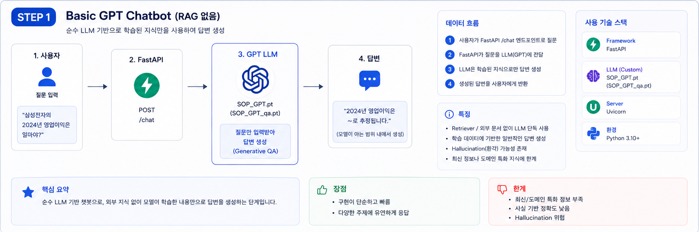
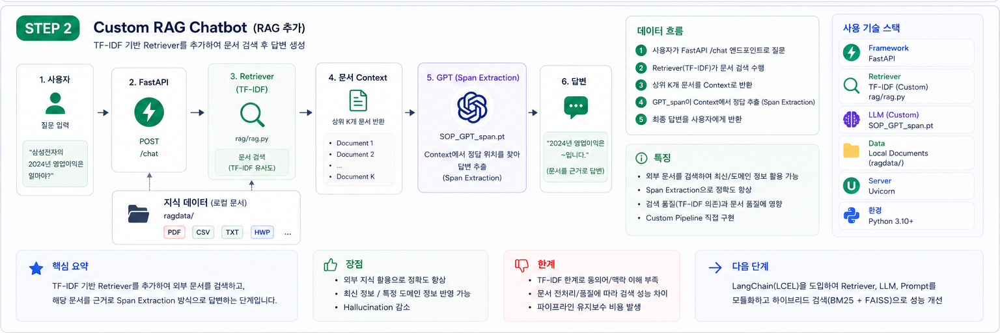
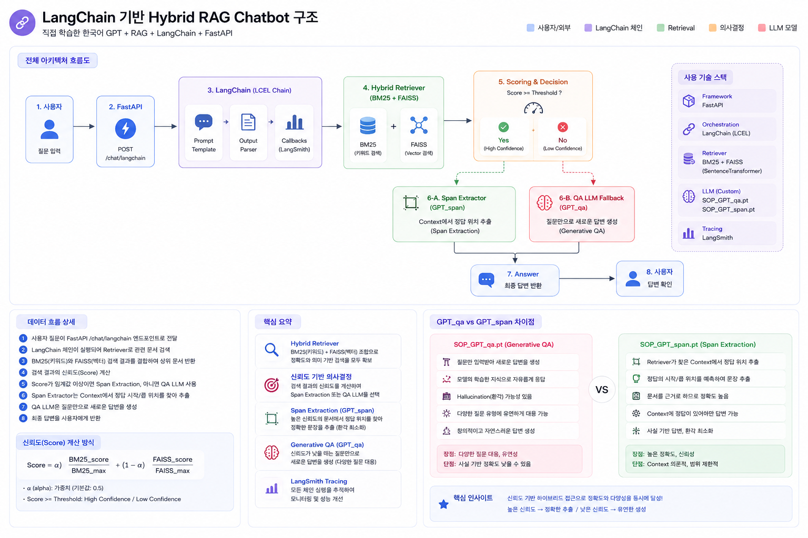

# 한국어 Mini-GPT 챗봇 (LangChain RAG)

자모(NFD) 단위 BPE 토크나이저부터 GPT 아키텍처, 학습, RAG, LangChain 파이프라인, FastAPI 서빙, LangSmith 트레이싱까지 전부 직접 구현한 한국어 챗봇 프로젝트.

## 개요
> 체크포인트 3개(`SOP_GPT.pt` / `SOP_GPT_qa.pt` / `SOP_GPT_span.pt`)가 역할을 나눠 쓰이는 구조.  
> 검색 방식에 따라 **기본 모델 / RAG / LangChain** 세 가지 모드를 선택하고, 각 모드에서 SOP_GPT와 Claude를 좌/우 분할화면으로 동시에 비교할 수 있다.



- **토크나이저**: 한글을 NFD로 분해(초성/중성/종성 자모)한 뒤 BPE 적용, NFC로 재조합해 출력 (직접 구현)
- **모델**: `CausalSelfAttention` / `Block` / `SOP_GPT`로 구성된 GPT 디코더 (block_size=256, n_embd=512, n_head=8, n_layer=12)
- **학습 단계**
  - **Stage 1 (이어쓰기)**: kowikitext + 한국어 챗봇 Q&A 데이터 + AI Hub 한국어 대화 데이터로 다음 토큰 예측 학습
  - **Stage 2 (Q&A 응답)**: songys/Chatbot_data(11,823쌍) + KorQuAD로 `"질문: ...\n답변: ..."` 포맷 파인튜닝
  - **Stage 4 (추출형 RAG QA)**: KorQuAD v1.0으로 정답의 시작/끝 토큰 **위치를 분류**하는 `SOP_GPT_Span` 학습
  - **Stage 5 (DPO)**: chosen/rejected 쌍으로 모델 선호 방향 정렬 (진행 중)
- **학습 최적화**: bf16 혼합 정밀도(`torch.autocast`), gradient accumulation, cosine LR decay
- **KV Cache**: 추론 시 K/V 텐서를 캐시해 증분 디코딩 — 반복 prefill 없이 마지막 토큰만 처리
- **생성**: temperature / top-k / top-p / repetition penalty 샘플링 + 종결 토큰(`.`/`?`/`!`) 기준 stop 조건 + SSE 스트리밍
- **LangChain 파이프라인**: `SOP_GPT`를 `BaseLLM`으로 래핑하고 LCEL로 검색기와 연결. 검색 방식(TF-IDF / BM25+FAISS)에 따라 체인을 교체할 수 있는 구조
- **Claude API 연동**: 동일한 검색기를 재사용하고 답변 생성만 `claude-haiku-4-5-20251001`으로 교체. SOP_GPT와 실시간 비교 가능
- **서빙**: FastAPI로 채팅 엔드포인트 + SSE 스트리밍 엔드포인트 제공 + 분할화면 웹 UI
- **트레이싱**: LangSmith로 체인 실행 기록 자동 수집 (APAC 엔드포인트)

## RAG 아키텍처



1. **지식 베이스**: KorQuAD v1.0 train+dev set 문단 + `ragdata/` 폴더 문서를 ~180자 단위 청크로 분할해 인덱싱
2. **검색(Retrieve)**: `source/rag/rag.py` — scikit-learn `TfidfVectorizer` + 코사인 유사도
3. **라우팅**: 코사인 유사도 점수 ≥ `0.25`이면 Stage 4(추출형 QA), 미만이면 Stage 2(잡담형)로 폴백
4. **추출(Extract)**: `SOP_GPT_Span`이 `"질문: {질문}\n참고: {청크}"` 안에서 정답의 시작/끝 토큰 위치를 직접 분류해 그 구간을 잘라 답으로 사용 (검증셋 기준 정확히 일치 31.5%, 포함/겹침 72.8%)

## LangChain RAG 아키텍처



RAG 모드와 동일한 라우팅·추출 구조를 재사용하되, 검색기를 **BM25+FAISS 하이브리드**로 교체한 모드.

1. **지식 베이스**: RAG 모드와 동일한 KorQuAD + `ragdata/` 청크 (~36K개)
2. **검색(Retrieve)**: `source/lc/retriever.py` — BM25(sparse) + FAISS(dense) 하이브리드
   - **BM25**: 단어 빈도 기반, 질문 키워드가 문서에 그대로 있을 때 강함
   - **FAISS** (`jhgan/ko-sroberta-multitask`): 문장 임베딩 기반, 단어가 달라도 의미가 같으면 검색됨
   - 두 점수를 `calibrate()`로 정규화 후 `α·sparse + (1-α)·dense` 합산 (α=0.5)
   - **Cross-Encoder 재정렬**: hybrid 상위 10개를 `bongsoo/klue-cross-encoder-v1`으로 재정렬해 최적 청크 선택
3. **라우팅**: hybrid score ≥ `0.515`이면 Stage 4(추출형 QA), 미만이면 Stage 2(잡담형)로 폴백
   - TF-IDF 단독 73.3% → 하이브리드+고정보정 82.7% (held-out 검증 기준)
4. **추출(Extract)**: RAG 모드와 동일한 `SOP_GPT_Span` 스팬 추출

## LangChain 파이프라인 구조

```
질문 (str)
 ├─ basic_chain     : PromptTemplate | SOP_GPT_LLM | StrOutputParser
 ├─ tfidf_rag_chain : TfidfRetriever → 유사도 라우팅(≥0.25) → SpanExtractor / SOP_GPT_LLM
 └─ lc_rag_chain    : HybridRetriever(BM25+FAISS) → 유사도 라우팅(≥0.515) → SpanExtractor / SOP_GPT_LLM
```

- `source/lc/llm.py`: `SOP_GPT`를 LangChain `LLM`으로 래핑 (`SOP_GPT_LLM`), `SOP_GPT_Span`을 `RunnableLambda` 주입용 함수로 반환 (`make_span_extractor`)
- `source/lc/chain.py`: `build_rag_chain(retriever, llm, span_extractor_fn, threshold)` — 검색기와 임계값만 달리해 `tfidf_rag_chain`과 `lc_rag_chain` 두 체인을 동일 함수로 조립
- `source/lc/retriever.py`: LangChain `BM25Retriever` + `FAISS` + `EnsembleRetriever` 기반 `HybridRetriever`

## 디렉토리 구조

```
chatbot/
├── README.md
├── version.md
├── images/                     # 아키텍처 다이어그램 이미지
│   ├── basic_gpt.png           # STEP 1 Basic GPT 흐름도
│   ├── rag_gpt.png             # STEP 2 Custom RAG 흐름도
│   └── langchain_gpt.png       # LangChain Hybrid RAG 구조도
├── .env                        # 비밀 아닌 설정 (tracing on/off, endpoint, project명) — gitignore
├── api_keys                    # API 키 보관 — gitignore
├── basicdata/                  # 참고 자료, 작업 계획, 세션 기록, 코드 설명서(info.md)
├── ragdata/                    # RAG 검색 인덱스에 추가할 커스텀 문서 (.txt/.md)
│   ├── rpg.md                  # RPG 장르 통합 설명
│   ├── rpg_jrpg.md             # JRPG 장르 상세
│   ├── rpg_mmorpg.md           # MMORPG 장르 상세
│   ├── rpg_mechanics.md        # RPG 공통 시스템 (레벨/스킬/아이템)
│   ├── rpg_trpg.md             # TRPG·D&D 규칙
│   ├── rpg_arpg.md             # ARPG 장르 상세
│   ├── rpg_korean_games.md     # 한국 RPG 역사
│   ├── ai_machine_learning.md  # AI·머신러닝 설명
│   └── korean_food.md          # 한국 음식 설명
└── source/
    ├── app/
    │   ├── app.py              # FastAPI 선언 + 라우터 등록 (진입점)
    │   ├── state.py            # 모델·체인·검색기 초기화 (import 시점 1회 실행)
    │   ├── models.py           # Pydantic 스키마
    │   ├── streaming.py        # SSE 헬퍼 (sop_stream, claude_rag_stream 등)
    │   ├── ui.py               # GET / 웹 UI (분할화면 HTML)
    │   └── routers/
    │       ├── chat.py         # non-streaming 엔드포인트 7개
    │       └── stream.py       # SSE 스트리밍 엔드포인트 6개
    ├── lc/                     # LangChain 통합 레이어
    │   ├── retriever.py        # HybridRetriever (BM25 + FAISS + Cross-Encoder 재정렬)
    │   ├── llm.py              # SOP_GPT_LLM (LangChain LLM 래퍼 + 스트리밍)
    │   ├── chain.py            # LCEL 파이프라인 조립
    │   └── claude_llm.py       # Claude API 연동 (답변 생성 + SSE 스트리밍)
    ├── lg/                     # LangGraph 파이프라인 레이어
    │   ├── state.py            # GraphState TypedDict
    │   ├── nodes.py            # 노드 팩토리 (retriever/grade/generate_span/generate_direct)
    │   └── graph.py            # StateGraph 조립 (build_graph) — 작성 중
    ├── rag/
    │   └── rag.py              # KorQuAD 유틸리티 + TF-IDF 검색기
    └── model/
        ├── bpe.py              # BPE 토크나이저 직접 구현 (+ tokenize_with_offsets)
        ├── tokenizer.py        # 코퍼스 로딩 (kowikitext, 챗봇 Q&A)
        ├── model.py            # GPT 아키텍처 (SOP_GPT, SOP_GPT_Span)
        ├── train_utils.py      # 공통 학습 루프 (early stopping, gradient accumulation)
        ├── chat.py             # 추론 함수 (chat, chat_qa, extract_answer)
        ├── main.py             # 진입점 (train / train_qa / train_span / chat*)
        ├── bpe_vocab.json
        ├── SOP_GPT.pt          # Stage 1 체크포인트 (이어쓰기, val loss 3.355)
        ├── SOP_GPT_qa.pt       # Stage 2 체크포인트 (Q&A, val loss 2.657)
        └── SOP_GPT_span.pt     # Stage 4 체크포인트 (추출형 RAG QA, val loss 3.092)
```

## 환경 설정

API 키와 LangSmith 설정은 프로젝트 루트의 두 파일에 보관합니다 (모두 gitignore 처리).

```
# .env — 비밀 아닌 설정
LANGSMITH_TRACING=true
LANGCHAIN_TRACING_V2=true
LANGSMITH_ENDPOINT=https://apac.api.smith.langchain.com
LANGSMITH_PROJECT=adapterz-langchain-textbook

# api_keys — 실제 키 값
LANGSMITH_API_KEY=...
ANTHROPIC_API_KEY=...   # Claude API 사용 시 필요
```

## 실행

```bash
# 의존성 설치
pip install fastapi uvicorn torch langchain langchain-community langchain-huggingface \
            langchain-core faiss-cpu rank_bm25 sentence-transformers scikit-learn python-dotenv \
            anthropic langgraph==0.2.70

# 스모크 테스트 (source/ 디렉토리에서)
cd source
python test.py               # 전체 테스트 (HybridRetriever 포함, 1~2분 소요)
python test.py --skip-hybrid # 빠른 테스트 (임베딩 모델 건너뜀)

# 웹 서버 (source/app/ 디렉토리에서)
cd source/app
uvicorn app:app --reload

# 모델 학습/대화 (source/model/ 디렉토리에서)
cd source/model

# 순차 학습 (Stage 1 → 2 → 4 → 5, 백그라운드 실행 권장)
nohup bash ../../train_all.sh > ../../train_all.log 2>&1 &

# 개별 실행
python main.py train         # Stage 1 학습
python main.py train_qa      # Stage 2 파인튜닝
python main.py train_span    # Stage 4 추출형 RAG QA 학습
python main.py train_dpo     # Stage 5 DPO 선호 학습 (진행 중)
python main.py chat          # Stage 1 이어쓰기 REPL
python main.py chat_qa       # Stage 2 Q&A REPL
python main.py chat_span     # Stage 4 RAG QA REPL
```

## API

**SOP_GPT 엔드포인트**
- `POST /generate` — `{"prompt": str}` → `{"text": str}` — Stage 1 이어쓰기
- `POST /chat/basic` — `{"question": str}` → `{"answer", "retrieved_context", "used_rag"}` — 검색 없이 QA 모델 직접 응답
- `POST /chat/rag` — `{"question": str}` → `{"answer", "retrieved_context", "used_rag"}` — TF-IDF 검색 + 유사도 라우팅
- `POST /chat/langchain` — `{"question": str}` → `{"answer", "retrieved_context", "used_rag"}` — BM25+FAISS 검색 + 유사도 라우팅

**Claude 엔드포인트**
- `POST /chat/claude/basic` — 검색 없이 Claude 직접 응답
- `POST /chat/claude/rag` — TF-IDF 검색 + Claude 답변
- `POST /chat/claude/langchain` — BM25+FAISS 검색 + Claude 답변

**SSE 스트리밍 엔드포인트** (text/event-stream, `data: {"type": "text"|"rag_context"|"done", "text": "..."}`)
- `POST /chat/{basic|rag|langchain}/stream` — SOP_GPT 스트리밍
- `POST /chat/claude/{basic|rag|langchain}/stream` — Claude 스트리밍

**UI / Docs**
- `GET /` — 분할화면 웹 채팅 UI (좌: SOP_GPT, 우: Claude)
- `GET /docs` — Swagger UI

자세한 개발 과정은 [basicdata/plan.md](basicdata/plan.md), 코드 설명은 [basicdata/info.md](basicdata/info.md), 단계별 변경 이력은 [version.md](version.md), 체인 평가 결과는 [basicdata/eval.md](basicdata/eval.md) 참고.

## 데이터 출처

본 프로젝트의 Stage 1 학습에 AI Hub에서 제공하는 아래 데이터셋을 활용했습니다.

- 011. 일상대화 한국어 멀티세션 데이터
- 020. 주제별 텍스트 일상 대화 데이터
- 141. 한국어 멀티세션 대화
- 297. SNS 데이터 고도화

본 AI 데이터는 **한국지능정보사회진흥원(NIA)**의 사업 결과물이며, AI Hub 이용약관에 따라 인공지능 학습 모델의 학습 목적으로만 사용합니다.
