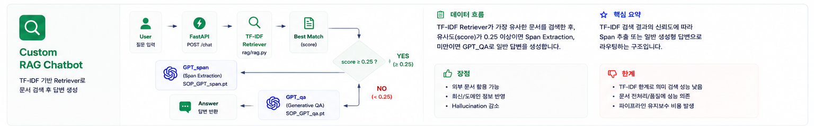
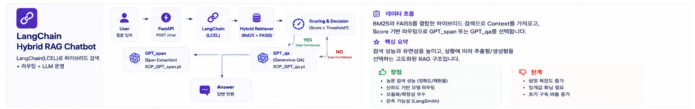
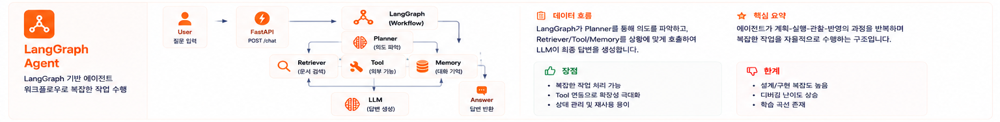

# RPG·게임 특화 한국어 Mini-GPT 챗봇

BPE 토크나이저 → GPT 학습 → RAG → LangChain/LangGraph 파이프라인 → Claude/Qwen 연동까지 전 과정 직접 구현한 한국어 챗봇.  
지식 베이스(`ragdata/`)를 **RPG·게임** 도메인으로 채워, 게임 장르·시스템·직군 관련 질문에 특화하여 답변한다.

## 특징

| 항목 | 내용 |
|---|---|
| 모델 | SOP_GPT (~97M, GPT-2 디코더) · Qwen3-1.7B (BF16/Q4_K_M) · Claude Haiku |
| 검색 | TF-IDF / BM25+FAISS 하이브리드 + calibrate 정규화 |
| 파이프라인 | LCEL 체인 · LangGraph StateGraph (retry 루프, 최대 2회) |
| 자동 라우팅 | Claude Haiku가 질문 유형 분류(chit_chat/factual/general) → 체인 자동 선택 |
| UI | SOP_GPT ↔ Claude 분할화면 + Qwen3 패널 + SSE 실시간 스트리밍 |
| 서빙 | FastAPI + LangSmith 트레이싱 (APAC 엔드포인트) |

---

## 학습 파이프라인


단계를 나눈 이유는 각 Stage가 서로 다른 능력을 순서대로 쌓기 위해서다. 처음부터 Q&A 포맷으로만 학습하면 언어 자체를 충분히 익히지 못한 채 형식만 흉내 내는 모델이 된다. 먼저 대규모 텍스트로 언어 패턴을 익힌 뒤(Stage 1), 그 위에 태스크를 순차적으로 올리는 전이학습 구조다.

| Stage | 역할 | 결과물 | 단계를 나눈 이유 |
|---|---|---|---|
| Stage 1 | 이어쓰기 (kowikitext + 챗봇 Q&A + AI Hub 대화) | `SOP_GPT.pt` | 베이스 언어 능력 확보. 다음 토큰 예측으로 어휘·문법·문맥을 먼저 학습 |
| Stage 2 | Q&A 파인튜닝 (`"질문: …\n답변: …"` 포맷) | `SOP_GPT_qa.pt` | 언어 능력 위에 질문→답변 형식을 추가 학습. Stage 1 없이 하면 형식만 흉내 냄 |
| Stage 4 | 추출형 RAG QA — `SOP_GPT_Span`이 정답의 시작/끝 토큰 위치 분류 | `SOP_GPT_span.pt` | RAG 컨텍스트가 주어졌을 때 생성보다 추출이 더 정확. 소규모 모델로 긴 문장을 생성하면 품질이 떨어지므로 분류 태스크로 전환 |
| Stage 5 | DPO 선호 정렬 | `SOP_GPT_dpo.pt` | 지도학습만으로는 "더 나은 답변"을 구별 못 함. chosen/rejected 쌍으로 선호 방향을 정렬. **실험 결과**: KorQuAD GT(명사구) vs 모델 오답(단어)은 스타일 불일치로 성능 저하. 챗봇 데이터(대화체 일치)로 val loss 0.0250까지 개선됐으나 실제 파이프라인 수치 변화 없음. 이유는 두 가지 — ① 추론 경로의 핵심이 Span 모델이라 QA 모델 DPO가 파이프라인에 영향을 주지 못함, ② 91M 소규모 모델에서 DPO는 이미 정답을 생성할 수 있는 능력이 전제되어야 함. 현 단계 `SOP_GPT_qa.pt` 유지. |

**최적화**: bf16 혼합 정밀도(`torch.autocast`) · gradient accumulation · KV Cache 증분 디코딩

---

## 모델 아키텍처

학습된 가중치(.pt)는 용량 문제로 저장소에 포함되지 않습니다.

### SOP_GPT — 이어쓰기 / QA 생성

GPT-2와 동일한 Pre-norm 디코더 전용 Transformer.

| 하이퍼파라미터 | 값 |
|---|---|
| block_size | 256 |
| n_embd | 768 |
| n_head / n_layer | 12 / 12 |
| 파라미터 수 | ~97M |

### SOP_GPT_Span — 추출형 QA

SOP_GPT 본체에 `qa_head: Linear(768 → 2)`를 달아 참고 문단 안에서 정답의 시작/끝 위치를 분류한다.  
생성이 아닌 분류 태스크이므로 오류 누적 없이 작은 모델로도 정확한 위치를 찾을 수 있다.

| 파일 | 역할 |
|---|---|
| `SOP_GPT.pt` | Stage 1 — 자유 텍스트 이어쓰기 |
| `SOP_GPT_qa.pt` | Stage 2 — RAG 미달 시 직접 답변 |
| `SOP_GPT_span.pt` | Stage 4 — RAG 성공 시 컨텍스트에서 정답 구간 추출 |

### Qwen3-1.7B — BF16 vs Q4_K_M

두 추론 엔진을 모두 지원한다. 용도에 따라 선택할 수 있도록 UI에서 별도 엔드포인트로 분리해뒀다.

| 엔진 | 백엔드 | 메모리 | 특징 |
|---|---|---|---|
| BF16 | Transformers + MPS | MPS 3.3 GB | 정확도 우세, 로딩 빠름 |
| Q4_K_M | llama-cpp + Metal | RSS 1.4 GB | 속도 우세, 메모리 절감 |

**Q4_K_M 설정**: context 추출 요청(`ask_with_context`)은 항상 `/no_think`, 30자 이상 물음표 포함 질문은 `/think` 자동 활성화. thinking 완료 후 빈 답변이면 `/no_think` 폴백. temperature 0.7 / top_p 0.9 명시.

KorQuAD 100문항 기준 벤치마크: BF16 **82%** / 2.68s · Q4_K_M **80%** / 0.81s — [상세 결과 →](basicdata/eval.md#qwen3-17b-bf16-vs-q4_k_m-벤치마크)

---

## RAG 파이프라인

**지식 베이스**: KorQuAD v1.0 train+dev (~61K 문단) + `ragdata/` 도메인 문서 → ~180자 단위 청크 (~36K개) 인덱싱

**ragdata 구성 (RPG·게임 특화)**:
- `rpg/` — JRPG · ARPG · MMORPG · TRPG · 한국 RPG 역사 · RPG 공통 시스템
- `gamejob/` — 게임 직군 · 개발 프로세스 용어 · BM/KPI(F2P, DAU, ARPU 등)

### STEP 2 — TF-IDF 검색



`TfidfVectorizer` + 코사인 유사도. score ≥ 0.25 → `SOP_GPT_Span` 스팬 추출, 미달 → `SOP_GPT_qa` 폴백.

**TF-IDF를 선택한 이유**: 외부 임베딩 모델 없이 `sklearn` 하나로 RAG 전체 흐름(문서 인덱싱 → 유사도 검색 → 스팬 추출 → 폴백)을 직접 구현하는 게 목적이었다. 구현이 단순하고 추가 의존성이 없어 RAG의 핵심 개념을 익히는 첫 단계로 적합했다. 단, 키워드가 정확히 일치하지 않으면 유사한 문서를 찾지 못하는 한계가 있어 STEP 3으로 발전시켰다.

### STEP 3 — BM25+FAISS 하이브리드 (LangChain)



- **BM25** (sparse): 키워드 매칭, 소문자 정규화로 영어 약어(`jrpg` 등) 대응
- **FAISS** (dense, `jhgan/ko-sroberta-multitask`): 의미 기반 검색
- `calibrate()`로 두 점수를 고정 범위 정규화 후 `0.5·sparse + 0.5·dense` 합산
- score ≥ 0.515 → 스팬 추출, 미달 → QA 폴백 (분류 정확도 73.3% → 82.7%)

**하이브리드를 선택한 이유**: TF-IDF(키워드 일치)와 임베딩(의미 유사도)은 서로 다른 종류의 질문에서 강점이 갈린다. "JRPG가 뭐야"처럼 고유명사가 포함된 질문은 sparse가 유리하고, "전투가 턴 방식인 RPG"처럼 키워드 없이 의미로 묻는 질문은 dense가 유리하다. 두 점수를 `calibrate()`로 정규화한 뒤 앙상블하면 어느 한쪽이 실패해도 다른 쪽이 보완할 수 있어 단독 검색기 대비 안정적인 정확도를 얻을 수 있다.

```
LCEL 체인
 ├─ basic_chain     : PromptTemplate | SOP_GPT_LLM | StrOutputParser
 ├─ tfidf_rag_chain : TfidfRetriever(≥0.25) → SpanExtractor / SOP_GPT_LLM
 └─ lc_rag_chain    : HybridRetriever(≥0.515) → SpanExtractor / SOP_GPT_LLM
```

### STEP 4 — LangGraph (retry 루프)



LangChain 체인의 조건 분기를 명시적 그래프로 표현. 검색 실패 시 임계값을 낮춰가며 자동 재시도.

```
init → retrieve → grade → generate_span    (RAG 성공)
                        → increment_retry → retrieve  (임계값 완화, 최대 2회)
                        → generate_direct             (재시도 소진)
```

| 모델 | retry 임계값 `[t0, t1, t2]` | 비고 |
|---|---|---|
| SOP_GPT | `[0.35, 0.25, 0.2]` | RAG 의존도 높아 낮게 설정 |
| Claude / Qwen3 | `[0.515, 0.375, 0.350]` | 자체 생성 능력 있어 높게 설정 (empirical 검증) |

**메모리**: `MemorySaver`(단기) + JSON 파일(장기). `thread_id = {userId}_{mode}` 형식.

엔진별 그래프: `build_graph(SOP_GPT)` · `build_claude_graph` · `build_qwen_graph` · `build_claude_agent_graph`

---

## 디렉토리 구조

```
chatbot/
├── ragdata/                    # RAG 지식 베이스 (파일 추가만으로 인덱스 자동 확장)
│   ├── rpg/                    # RPG 장르별 문서 (JRPG·ARPG·MMORPG·TRPG·한국 RPG)
│   └── gamejob/                # 게임 직군·개발 용어·비즈니스 용어
├── basicdata/                  # 프로젝트 문서 (info.md, eval.md, plan.md, report.md)
├── scripts/                    # 유틸리티 스크립트 (캘리브레이션, 임계값 검증 등)
└── source/
    ├── app/                    # FastAPI 서빙 레이어
    │   ├── app.py              # 진입점 + 라우터 등록 + GET / 엔드포인트
    │   ├── state.py            # 모델·체인·검색기 초기화 (서버 기동 시 1회)
    │   ├── history.py          # 히스토리 영속화 (load/save/append, data/history/)
    │   ├── auth.py             # ID+PWD 로그인/사용자 생성
    │   ├── streaming.py        # SSE 헬퍼 (자동 라우팅 포함)
    │   ├── static/             # 정적 파일 (/static/* 경로로 서빙)
    │   │   ├── index.html      # 웹 UI (로그인 → 분할화면 채팅)
    │   │   └── style.css       # 전체 스타일시트
    │   └── routers/            # chat.py (non-streaming) · stream.py (SSE)
    ├── llm/                    # LLM 래퍼
    │   ├── sop_llm.py          # SOP_GPT → LangChain LLM 래퍼
    │   ├── claude_llm.py       # Claude API (답변·스트리밍·Agent 도구)
    │   └── qwen_llm.py         # Qwen3-1.7B (QwenTransformers BF16 + QwenGGUF Q4_K_M)
    ├── lc/                     # LangChain 통합
    │   ├── retriever.py        # HybridRetriever (BM25 + FAISS)
    │   ├── chain.py            # LCEL 체인 조립
    │   └── router.py           # 질문 자동 분류기 (Claude Haiku)
    ├── lg/                     # LangGraph 파이프라인
    │   ├── models.py           # GraphState / AgentState TypedDict
    │   ├── nodes.py            # 노드 팩토리 10개 (SOP_GPT 4 + Claude 4 + Qwen 2)
    │   └── graph.py            # StateGraph 조립
    ├── rag/rag.py              # KorQuAD 유틸리티 + TF-IDF 검색기
    └── model/
        ├── sop_model/          # SOP_GPT 학습·추론 패키지
        │   ├── bpe.py          # BPE 토크나이저 직접 구현
        │   ├── tokenizer.py    # 코퍼스 로딩 (kowikitext, 챗봇 Q&A, AI Hub)
        │   ├── model.py        # GPT 아키텍처 (SOP_GPT, SOP_GPT_Span)
        │   ├── train_utils.py  # 공통 학습 루프 (early stopping, bf16 autocast)
        │   ├── chat.py         # 추론 함수 (chat_qa, extract_answer)
        │   ├── dpo.py          # DPO 학습 모듈 (Stage 5)
        │   ├── main.py         # 진입점 (train / chat 모드)
        │   ├── SOP_GPT.pt      # Stage 1 체크포인트
        │   ├── SOP_GPT_qa.pt   # Stage 2 체크포인트
        │   └── SOP_GPT_span.pt # Stage 4 체크포인트
        └── qwen/               # Qwen3-1.7B 모델 파일 (BF16 + Q4_K_M GGUF)
```

---

## 환경 설정

```
# .env
LANGSMITH_TRACING=true
LANGCHAIN_TRACING_V2=true
LANGSMITH_ENDPOINT=https://apac.api.smith.langchain.com
LANGSMITH_PROJECT=adapterz-langchain-textbook

# api_keys
LANGSMITH_API_KEY=...
ANTHROPIC_API_KEY=...
```

## 실행

```bash
uv sync                          # 의존성 설치 (최초 1회)
```

### Qwen3-1.7B 모델 파일 준비

모델 파일은 용량 문제로 GitHub에 포함되지 않습니다. 아래 두 가지 중 하나를 `source/model/qwen/`에 준비하세요.

**BF16 (QwenTransformers, 약 3.4GB)**
```bash
pip install huggingface_hub
huggingface-cli download Qwen/Qwen3-1.7B --local-dir source/model/qwen/Qwen3-1.7B
```

**Q4_K_M GGUF (QwenGGUF, 약 1.1GB) — 권장**
```bash
huggingface-cli download Qwen/Qwen3-1.7B-GGUF \
  Qwen3-1.7B-Q4_K_M.gguf \
  --local-dir source/model/qwen/
```

또는 [Qwen3-1.7B-GGUF](https://huggingface.co/Qwen/Qwen3-1.7B-GGUF) 페이지에서 `Qwen3-1.7B-Q4_K_M.gguf`를 수동으로 받아 `source/model/qwen/`에 두면 됩니다.

### 서버 실행

```bash
# source/app/ 디렉토리에서
uv run uvicorn app:app
# 또는 venv를 먼저 활성화한 경우
source .venv/bin/activate && uvicorn app:app
```

### 모델 학습

```bash
# source/model/sop_model/ 디렉토리에서
uv run python main.py train        # Stage 1
uv run python main.py train_qa     # Stage 2
uv run python main.py train_span   # Stage 4
uv run python main.py train_dpo    # Stage 5 (테스트 필요 시 진행)
```

## API

| 엔드포인트 | 설명 |
|---|---|
| `POST /auth/login` | 로그인 / 신규 계정 자동 생성 |
| `POST /chat/auto/stream` | **자동 라우팅** SOP_GPT 스트리밍 (추천) |
| `POST /chat/claude/auto/stream` | **자동 라우팅** Claude 스트리밍 (추천) |
| `POST /chat/{basic\|rag\|langchain\|langgraph}` | SOP_GPT 각 모드 |
| `POST /chat/claude/{basic\|rag\|langchain\|langgraph}` | Claude 각 모드 |
| `POST /chat/qwen/langgraph/stream` | Qwen3 BF16 LangGraph |
| `POST /chat/qwen-q/langgraph/stream` | Qwen3 Q4_K_M LangGraph |
| `GET /` | 웹 UI |
| `GET /docs` | Swagger UI |

SSE 이벤트 타입: `mode` · `text` · `text_fallback` · `rag_context` · `status` · `done`

---

## 데이터 출처

본 프로젝트의 Stage 1 학습에 **한국지능정보사회진흥원(NIA)** AI Hub 데이터셋을 활용했습니다. AI Hub 이용약관에 따라 인공지능 학습 목적으로만 사용합니다.

- 일상대화 한국어 멀티세션 데이터
- 주제별 텍스트 일상 대화 데이터
- 한국어 멀티세션 대화
- SNS 데이터 고도화

자세한 개발 과정: [basicdata/plan.md](basicdata/plan.md) · 변경 이력: [version.md](version.md) · 평가 결과: [basicdata/eval.md](basicdata/eval.md) · 회고: [docs/review.md](docs/review.md) · 인스턴스 관련 보고 자료: [basicdata/report.md](basicdata/report.md) · HTTP/HTTPS 통신 분석: [docs/wireshark_report.md](docs/wireshark_report.md)
