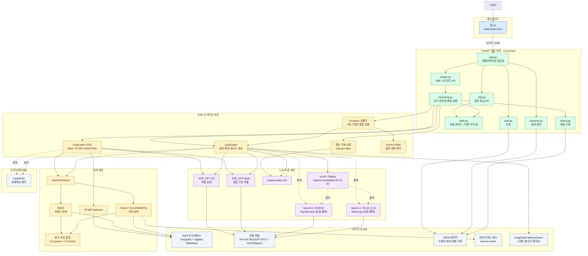
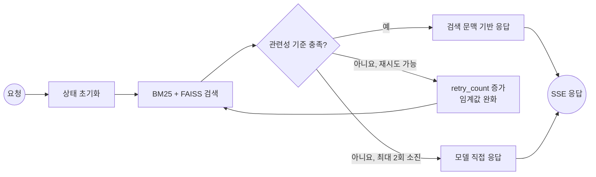
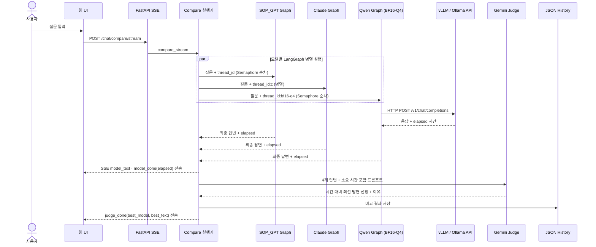

# LLM 챗봇 아키텍처

이 문서는 `LLM_Project/chatbot`의 실제 코드 구성을 기준으로 웹 요청, RAG 파이프라인,
모델 추론, 데이터 저장소 사이의 관계를 나타낸다.

## 전체 시스템 구조

## LangGraph RAG 실행 흐름

SOP_GPT, Claude, Qwen 그래프는 같은 제어 흐름을 공유하며 마지막 생성 노드에서 사용할
모델만 다르다.

## Compare 모드 실행 흐름

