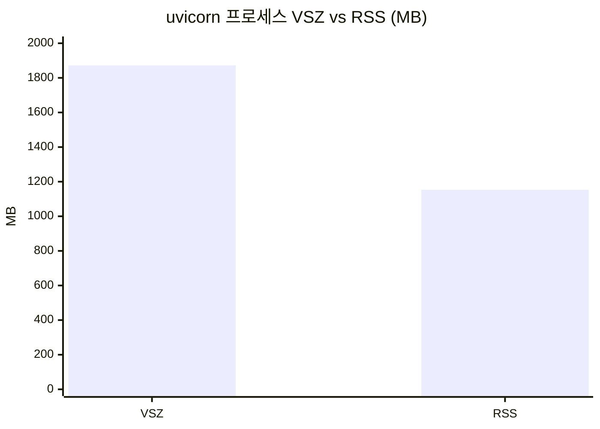
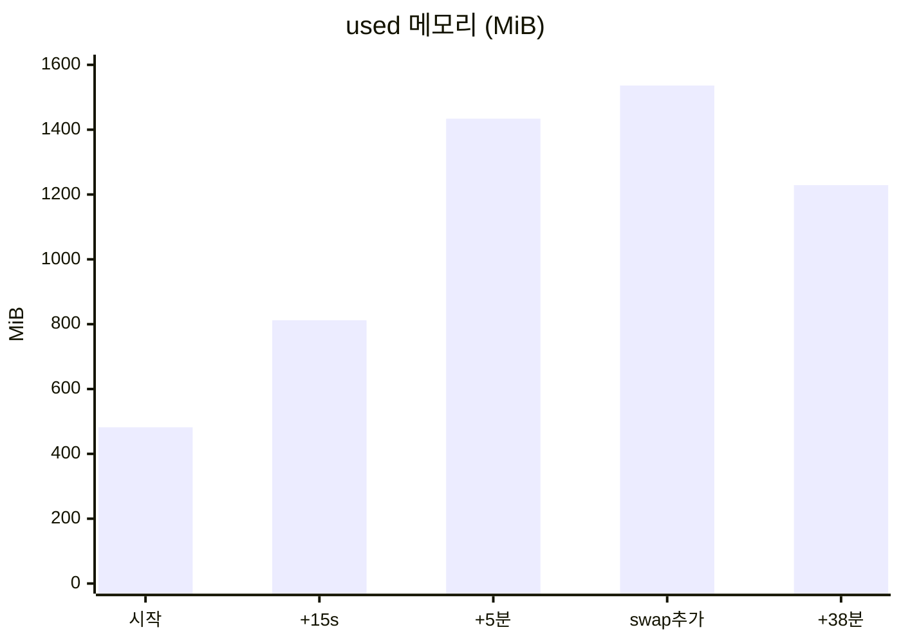
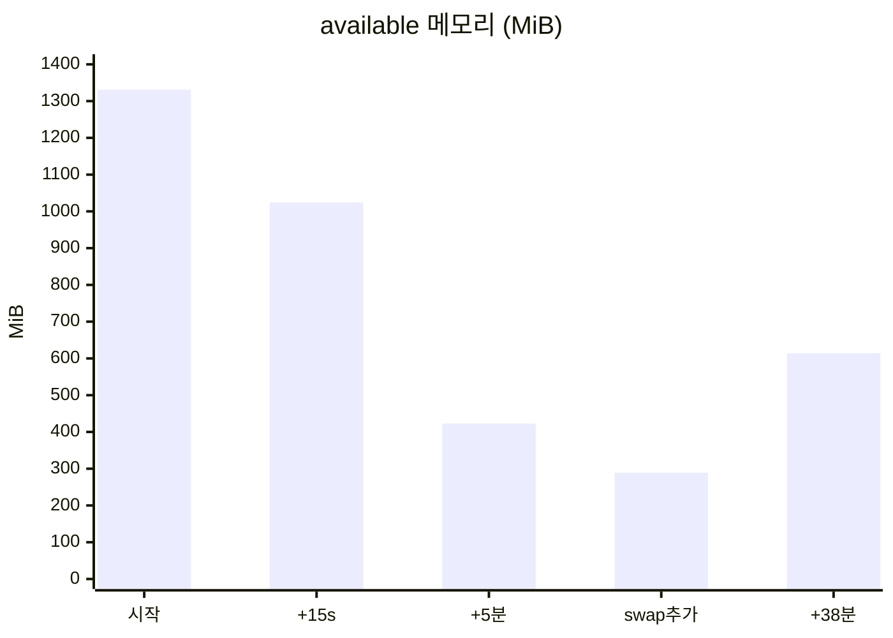
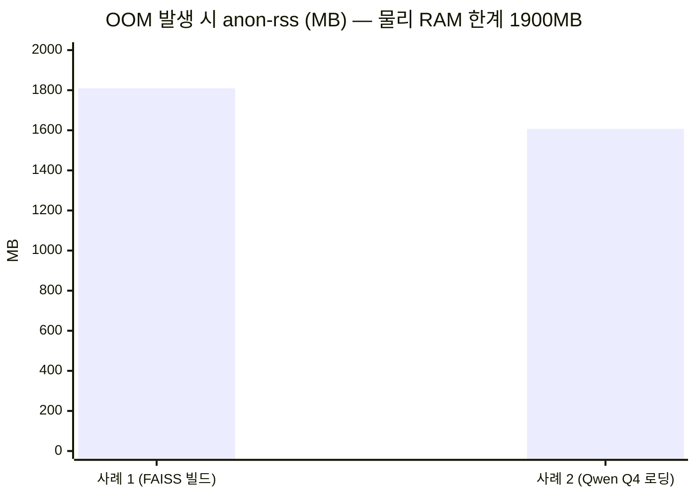

# Unix 환경에서 개인 프로젝트 서버 실행 및 프로세스·스레드·메모리 분석 보고서

## 1. 개요

- **목적**: `source/app/app.py`(FastAPI 기반 SOP_GPT 챗봇 서버)를 실행하면서 핵심 Unix 명령어로 프로세스/스레드/메모리 상태를 조회하고, 실제로 발생한 장애(OOM)를 진단·해결하는 과정을 기록한다.
- **환경**: EC2 인스턴스(Amazon Linux), 단일 vCPU, RAM 1.9GiB, swap 없음(초기), 루트 디스크 8GB 중 85% 사용.

```
$ nproc
1
$ cat /proc/cpuinfo | grep "model name"
model name : Intel(R) Xeon(R) CPU E5-2686 v4 @ 2.30GHz
$ free -h
              total   used   free  shared  buff/cache  available
Mem:          1.9Gi   437Mi  1.1Gi   0.0Ki      406Mi      1.4Gi
Swap:            0B      0B     0B
```

RAM 2GB 미만 + swap 0B + vCPU 1개라는, 리소스가 매우 제한된 환경이라는 점이 이후 모든 장애의 근본 배경이 된다.

**인스턴스 업그레이드 이력**: 원래는 `t2.nano`(1 vCPU, 0.5GiB RAM)였으나, 작업 도중 반복되는 OOM(6절 참고)을 감당하지 못해 `t2.small`(1 vCPU, 2GiB RAM)로 stop→start 방식으로 업그레이드했다.

```
$ TOKEN=$(curl -s -X PUT "http://169.254.169.254/latest/api/token" -H "X-aws-ec2-metadata-token-ttl-seconds: 21600")
$ curl -s -H "X-aws-ec2-metadata-token: $TOKEN" http://169.254.169.254/latest/meta-data/instance-type
t2.small
```

- **업그레이드 계기**: FAISS 인덱스 최초 빌드 중 1차 OOM(6.1절) 발생 → 오프라인 빌드 스크립트로 분리했음에도 CPU 1개로는 인코딩 자체가 수 시간 걸릴 정도로 느렸고, 그 사이에도 메모리 여유가 계속 부족(가용 300~400MB 수준)해 재차 OOM 위험이 반복됨. RAM을 늘려 여유 폭을 확보하기 위해 `t2.small`로 업그레이드.
- **주의할 점**: `t2.small`은 `t2.nano` 대비 RAM만 4배(0.5→2GiB) 늘어날 뿐, **vCPU는 여전히 1개**다. 즉 이번 업그레이드는 "동시에 더 많은 모델을 메모리에 올릴 여유"는 늘려주지만, FAISS 인코딩처럼 CPU 바운드인 작업의 속도 자체는 개선하지 못한다 — 실제로 업그레이드 이후에도 `nproc`은 계속 1로 관찰되었다(4절 참고).

## 2. 서버 실행

```
$ cd source/app
$ uv run uvicorn app:app --host 0.0.0.0 --port 8000
```

서버는 시작 시(`state.py`) BPE 토크나이저, PyTorch 체크포인트 3종(gen/QA/Span), TF-IDF 검색기, 하이브리드(BM25+FAISS) 검색기, LangGraph 파이프라인 4종, (있다면) Qwen BF16/Q4 모델까지 총 12단계를 순서대로 메모리에 로드한 뒤 요청을 받기 시작하는 구조다.

## 3. 사용한 핵심 명령어와 역할

| 명령어 | 용도 |
|---|---|
| `ps aux \| grep <프로세스명>` | 프로세스 목록에서 PID, CPU%, MEM%, VSZ(가상메모리), RSS(실제 상주메모리), STAT(상태), 실행시간 확인 — 한 시점의 스냅샷이라 스크립트로 반복 조회하거나 조건 판단에 적합. 화면에 상주하며 실시간으로 갱신되는 대화형 감시(사람이 눈으로 추이를 계속 지켜보는 용도)에는 `top`/`htop`이 더 적합하며, 이번엔 비대화형 환경이라 `ps aux`+`free -h` 반복 호출로 대체했다 |
| `free -h` | 전체 시스템의 물리 메모리/스왑 사용량(used/free/buff-cache/available)을 사람이 읽기 쉬운 단위로 확인 |
| `dmesg -T` | 커널 링버퍼 로그를 타임스탬프 포함해서 확인 (OOM-killer 등 커널 이벤트 추적). 일반 사용자 권한 제한 시 `sudo journalctl -k`로 대체 |
| `sudo journalctl -k -n <N> --no-pager` | systemd 저널에 보존된 커널 로그 조회(재부팅 후에도 dmesg 링버퍼보다 오래 보존됨) |
| `swapon --show` / `free -h`의 Swap 행 | 스왑 장치 존재 여부와 사용량 확인 |
| `sudo fallocate -l <크기> /swapfile && chmod 600 && mkswap && swapon` | 스왑 파일 생성·활성화 (메모리 부족 시 디스크를 보조 메모리로 사용) |
| `pgrep -f <패턴>` / `pkill -f <패턴>` | 이름 패턴으로 프로세스 존재 확인 및 종료 |
| `df -h` / `du -sh <경로>` | 디스크 여유공간 확인, 디렉터리별 사용량 breakdown |
| `curl -s -o /dev/null -w "%{http_code}"` | 서버가 실제로 요청을 처리할 수 있는 상태(Ready)인지 HTTP 레벨에서 확인 |

## 4. 프로세스·스레드 상태 관찰

`ps aux`로 확인한 실제 프로세스 트리(일부 발췌, 필드는 `USER PID %CPU %MEM VSZ RSS TTY STAT START TIME COMMAND` 순):

```
ec2-user  7792  0.1  1.5  239712  31560 ?  Sl  14:55  0:00 uv run uvicorn app:app ...
ec2-user  7795 49.3 57.3 1872388 1153124 ? R  14:55  0:11 .../python3 .../uvicorn app:app ...
```

- **STAT 코드 관찰**:
  - `Sl` — sleeping, 멀티스레드(`l`) 프로세스. `uv`가 uvicorn을 실행하는 래퍼 프로세스가 대기 중일 때 나타남.
  - `R` / `Rl` — 실행 중(runnable). 모델 로딩·인코딩처럼 CPU를 계속 쓰는 구간에서 관찰됨. 이 서버는 vCPU가 1개뿐이라 `R` 상태 프로세스가 항상 CPU를 독점하는 형태로 동작한다.
  - `D` — 디스크 I/O 등 인터럽트 불가능한 대기 상태. FAISS 인덱스 파일을 디스크에서 읽거나 swap-in/out이 발생할 때 관찰됨(메모리 부족으로 swap 압박이 심할 때 빈도가 늘어남).
- **VSZ vs RSS**: 가상주소공간(VSZ)은 항상 물리 메모리 사용량(RSS)보다 훨씬 크게 잡힌다(예: VSZ 1.87GB vs RSS 1.15GB).



이는 PyTorch/CUDA 런타임, 공유 라이브러리, mmap된 모델 파일(GGUF 등)이 실제로 상주하지 않아도 주소공간을 예약하기 때문 — RSS만이 실제 메모리 압박을 반영하는 지표다.
- **스레드**: 이 서버는 단일 uvicorn worker 프로세스 안에서 PyTorch/FAISS/BM25 연산이 내부적으로 스레드를 사용한다. `OMP_NUM_THREADS=1`을 `app.py`에서 명시적으로 설정해두었는데(`os.environ["OMP_NUM_THREADS"] = "1"`), 이는 vCPU 1개 환경에서 멀티스레드 연산이 오히려 컨텍스트 스위칭 오버헤드만 늘리는 것을 방지하기 위한 설정으로 보인다.

## 5. 메모리 상태 시계열 분석

FAISS 인덱스를 처음 빌드하는 동안 `free -h`를 반복 관찰한 기록:

| 시각(경과) | used | available | swap used | 비고 |
|---|---|---|---|---|
| 시작 직후 | 482Mi | 1.3Gi | - | 임베딩 모델 로딩 전 |
| +15s | 812Mi | 1.0Gi | - | 임베딩 모델(jhgan/ko-sroberta-multitask) 로딩 중 |
| +5분 | 1.4Gi | 423Mi | - | 배치 인코딩 진행 중, 가용 메모리 급감 |
| swap 추가 직후 | 1.5Gi | 289Mi | 0Mi | 512MB swap 활성화 |
| +38분(빌드 중) | 1.2Gi | 614Mi | 453Mi | swap이 실제로 쓰이기 시작 — 안전망 작동 확인 |

**used 메모리 추이 (MiB)**



**available 메모리 추이 (MiB)**



**해석**: `available`은 단순 `free`가 아니라 캐시 회수 가능분까지 포함한 "즉시 할당 가능한" 메모리 추정치다. 이 값이 200MB 아래로 떨어지는 구간에서 반복적으로 위험 신호가 나타났고, swap이 없을 때는 그 시점에 바로 OOM-killer가 개입했다.

## 6. 장애 진단 사례: OOM(Out-Of-Memory) 2건

### 사례 1 — FAISS 인덱스 최초 빌드 중 OOM

```
$ sudo journalctl -k -n 30 --no-pager | tail
... oom-kill:constraint=CONSTRAINT_NONE,...,task=uvicorn,pid=3316,uid=1000
... Out of memory: Killed process 3316 (uvicorn) total-vm:3854312kB, anon-rss:1810108kB, ...
```

- **증상**: `uvicorn` 실행 중 아무 에러 메시지 없이 셸 프롬프트로 복귀. 애플리케이션 로그에는 마지막으로 `[hybrid] FAISS 인덱스 배치 빌드 중...`만 출력되고 끊김.
- **진단 순서**: ① `free -h`로 스왑 0B, RAM 1.9GiB 확인 → ② `dmesg -T` 권한 문제로 `sudo journalctl -k`로 전환 → ③ `oom-kill` / `Killed process` 키워드로 필터링 → ④ 커널이 남긴 `anon-rss` 값(1.81GB)이 총 RAM에 근접함을 확인 → SIGKILL(신호 9)이라 애플리케이션이 아무것도 출력하지 못하고 즉사했음을 확인.
- **근본 원인**: 이미 SOP_GPT 3종 모델 + TF-IDF 검색기가 메모리에 올라간 상태에서, 임베딩 모델(jhgan/ko-sroberta-multitask, 442MB) 로딩과 4.3만 개 passage의 배치 인코딩이 겹쳐 순간 메모리 사용량이 물리 RAM을 초과.
- **조치**: 다른 무거운 모델을 로드하지 않는 별도 오프라인 스크립트(`source/build_index.py`)를 작성해, FAISS 인덱스·calibration 캐시만 먼저 빌드하고 디스크에 저장. 이후 서버 기동 시에는 캐시를 그대로 읽기만 하므로 재인코딩이 필요 없다.
- **추가 안전조치**: 디스크 여유공간(1.3GB)을 고려해 512MB 크기의 swap 파일을 생성해 순간 스파이크에 대한 완충 여력을 확보.

```
$ sudo fallocate -l 512M /swapfile
$ sudo chmod 600 /swapfile
$ sudo mkswap /swapfile
$ sudo swapon /swapfile
$ swapon --show
NAME      TYPE SIZE USED PRIO
/swapfile file 512M   0B   -2
```

### 사례 2 — Qwen Q4_K_M(GGUF) 로딩 중 OOM

```
... oom-kill:...,task=uvicorn,pid=7317,uid=1000
... Out of memory: Killed process 7317 (uvicorn) total-vm:4799584kB, anon-rss:1607464kB, ...
```

- **증상**: FAISS 캐시 적용 후 재기동 시, `[6/12] 하이브리드 검색기(BM25+FAISS) 로딩 완료.`까지는 정상 출력되었으나 `[6/12] Qwen Q4_K_M (양자화) 로딩 중...`에서 다시 조용히 종료.
- **진단**: `sudo journalctl -k --since "-2min"`으로 직전 2분 이내 OOM 로그만 좁혀서 확인 → 앞 단계(gen/QA/Span/TF-IDF/하이브리드 검색기)는 전부 정상 완료된 뒤였고, 새로 추가되는 컴포넌트(Qwen Q4 GGUF, `ls -lh` 확인 결과 1.1GB)만이 원인 후보로 좁혀짐.
- **근본 원인**: `source/model/qwen/Qwen3-1.7B-Q4_K_M.gguf`(1.1GB)를 나머지 스택과 동시에 메모리에 올리려 했고, 512MB swap으로도 감당이 안 됨.
- **조치**: `state.py`가 이미 `Q4_PATH.exists()`로 파일 존재 여부를 확인해 없으면 `[skip] Qwen Q4 모델 없음 — qwen-q 엔드포인트 비활성화` 경로로 우아하게 넘어가도록 설계되어 있었으므로, 코드 수정 없이 GGUF 파일을 `source/model/qwen/_disabled/`로 이동시켜 해당 분기를 타도록 유도(가역적 조치).

```
$ mv source/model/qwen/Qwen3-1.7B-Q4_K_M.gguf source/model/qwen/_disabled/
```



## 7. 조치 후 검증

재기동 후 백그라운드 프로세스를 다음 방식으로 감시해 "정상 기동 / 프로세스 사망 / OOM" 세 가지 결과를 구분했다:

```bash
while true; do
  curl -s -o /dev/null -w "%{http_code}" --max-time 2 http://localhost:8000/docs | grep -q "^200$" && { echo READY; break; }
  pgrep -f "uvicorn app:app" >/dev/null || { echo DIED; break; }
  sudo journalctl -k --since "-2min" --no-pager | grep -qi "oom-kill" && { echo OOM; break; }
  sleep 3
done
```

- 결과: `SERVER_READY` — `[10/12]`까지 전 단계 정상 로그 + `/docs` HTTP 200 확인.
- 기동 후에도 `free -h` 기준 가용 메모리 59~178MB, swap 사용량 최대 510MB(511MB 중)까지 근접 — 여전히 여유가 거의 없는 상태로 운영됨.
- 실제 엔드포인트 호출(`curl -X POST .../chat/langchain`, `/chat/basic`, `/chat/langgraph`)로 하이브리드 RAG 검색·생성 파이프라인이 실제로 정상 동작함을 확인.

## 8. 결론 및 교훈

1. **`ps aux`의 RSS**가 실제 물리 메모리 압박을 보여주는 지표이고, VSZ는 참고용일 뿐이다. STAT 코드(R/S/D)로 "CPU 바운드"인지 "I/O(혹은 스왑) 바운드"인지 구분할 수 있다.
2. **`free -h`의 available**을 시계열로 관찰하면 OOM이 터지기 전에 위험 구간(수백 MB 이하)을 미리 감지할 수 있다.
3. **`dmesg`가 권한/버퍼 회전으로 막히면 `journalctl -k`가 대안**이 된다 — 커널 로그는 재부팅 이전 것도 저널에 남아있을 수 있다.
4. SIGKILL로 죽는 프로세스(OOM-killer)는 애플리케이션 레벨 로그를 전혀 남기지 못하므로, "에러 없이 셸로 복귀"하는 증상 자체가 OOM의 강력한 단서다 — 커널 로그 확인이 최우선 진단 단계여야 한다.
5. 메모리가 극도로 제한된 환경에서는 **무거운 컴포넌트를 한꺼번에 올리지 않고 단계적으로 분리**(오프라인 사전 빌드, 조건부 로딩/스킵 분기 활용)하는 것이 코드 수정 없이도 가장 빠르게 적용 가능한 완화책이며, swap은 근본 해결책이 아니라 스파이크에 대한 보조 완충재로 봐야 한다.
