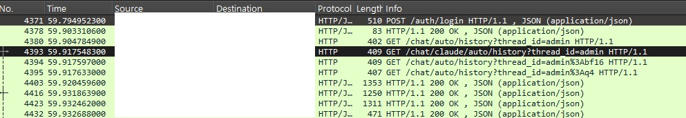
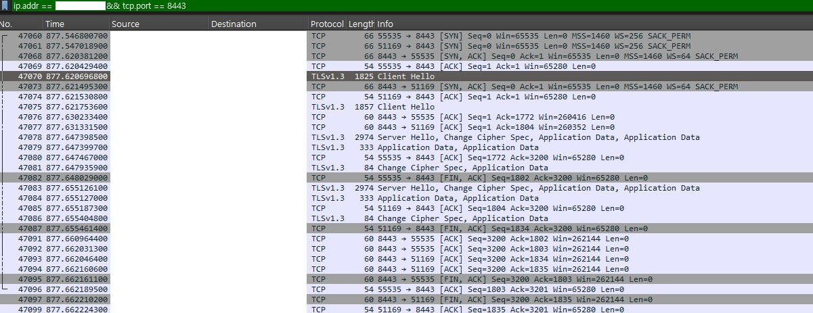

# Wireshark로 HTTP/HTTPS 통신 차이 분석

Wireshark를 이용해 개인 프로젝트 챗봇 서버의 HTTP와 HTTPS 통신을 캡처하고, 두 프로토콜 간의 차이를 직접 확인했다. 클라이언트(Wireshark가 설치된 컴퓨터)와 서버는 서로 다른 컴퓨터로 구성했다.

---

## HTTPS 환경 구성

uvicorn은 기본적으로 HTTP로 서비스된다. HTTPS로 전환하기 위해 자체 서명 인증서(Self-Signed Certificate)를 생성하고 서버 기동 시 SSL 옵션을 추가했다.

**인증서 생성**

```bash
openssl req -x509 -newkey rsa:4096 -keyout key.pem -out cert.pem -days 365 -nodes -subj "/CN=내 IP"
```

| 옵션 | 의미 |
|---|---|
| `-x509` | 자체 서명 인증서 생성 |
| `-newkey rsa:4096` | 4096비트 RSA 키 신규 생성 |
| `-nodes` | 개인키에 패스프레이즈 없이 저장 (서버 자동 기동용) |
| `-days 365` | 인증서 유효기간 365일 |
| `-subj "/CN=..."` | 서버 IP를 Common Name으로 지정 |

**HTTPS 서버 기동**

```bash
uv run uvicorn source.app.app:app --host 0.0.0.0 --port 8443 --ssl-keyfile key.pem --ssl-certfile cert.pem
```

`--host 0.0.0.0`을 지정해야 외부 컴퓨터에서 접속이 가능하다. 생략하면 `127.0.0.1`(로컬)에만 바인딩된다.

---

## Wireshark 캡처 결과

### HTTP 통신



HTTP는 데이터를 평문(Plaintext)으로 전송한다. Wireshark로 캡처하면 다음과 같이 요청/응답의 모든 내용이 그대로 노출된다.

- 어떤 엔드포인트에 어떤 HTTP 메서드로 요청했는지 (`POST /auth/login`, `GET /chat/auto/history`)
- 응답 상태코드 (`200 OK`, `409 Conflict`)
- Content-Type 등 헤더 정보 (`JSON (application/json)`)
- 요청/응답 바디의 실제 데이터

네트워크 경로 상에 있는 누구든 패킷을 가로채면 내용을 즉시 읽을 수 있다.

---

### HTTPS 통신



HTTPS는 TLS(Transport Layer Security)로 데이터를 암호화한다. 동일하게 패킷을 캡처해도 내용을 확인할 수 없다.

캡처에서 보이는 것은 암호화 이전의 TLS 핸드셰이크 과정뿐이다.

| 단계 | 패킷 | 설명 |
|---|---|---|
| 1 | `Client Hello` | 클라이언트가 지원하는 TLS 버전·암호화 알고리즘 목록을 서버에 전달 |
| 2 | `Server Hello` | 서버가 사용할 알고리즘 선택 및 인증서 전달 |
| 3 | `Change Cipher Spec` | 이후 통신은 협상된 암호화 방식으로 전환함을 알림 |
| 4 | `Application Data` | 실제 요청/응답 데이터 — 암호화되어 내용 확인 불가 |

핸드셰이크 이후 전송되는 모든 데이터는 `Application Data`로만 표시되며, 어떤 엔드포인트에 무엇을 요청했는지, 응답 내용이 무엇인지 전혀 알 수 없다.

---

## 정리

| 항목 | HTTP | HTTPS |
|---|---|---|
| 전송 방식 | 평문 | TLS 암호화 |
| Wireshark 가시성 | 요청·응답 전체 노출 | 핸드셰이크만 보이고 데이터는 불투명 |
| 중간자 공격 취약성 | 있음 | 없음 (키 없이 복호화 불가) |
| 기본 포트 | 80 | 443 |
| 인증서 필요 | 불필요 | 필요 (공인 CA 또는 자체 서명) |

HTTPS는 통신 내용을 암호화하는 것 외에도 서버 인증서를 통해 클라이언트가 올바른 서버에 접속하고 있음을 검증한다. 자체 서명 인증서는 암호화 기능은 동일하지만 신뢰할 수 있는 CA의 검증을 거치지 않으므로 브라우저에서 경고가 표시된다.
